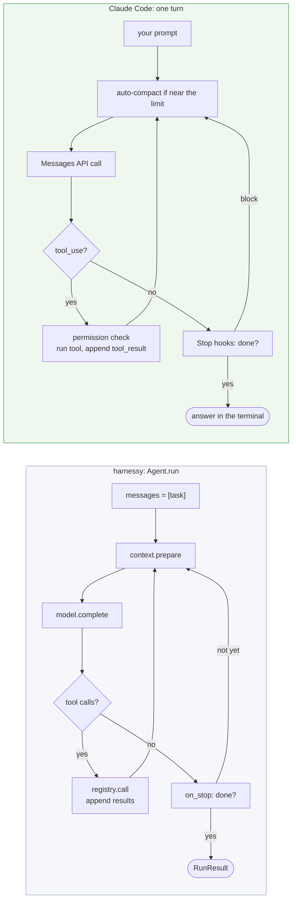

# harnessy and Claude Code: the same harness, at two sizes

You use a harness every day: Claude Code. This page puts the two side by side, module by module, so that each week of the course points at something you have already seen in your terminal. It also lists what Claude Code has that harnessy does not (good stretch exercises) and the few things harnessy does that Claude Code does not.

> **In one line:** Claude Code is the same loop you write in week 2, with the same organs bolted on: tools, context, memory, hooks, approvals, subagents and a todo list. Everything that makes it feel like a product lives in the harness, not in the model.

Claude Code facts here were checked against version 2.1.283. It changes quickly; if something has moved, `claude --help` and `/help` are the source of truth.

## 1. The same loop

Strip away the terminal UI and Claude Code runs exactly the loop in `solutions/harnessy/loop.py`: send the history to the model, run the tools it asks for, append the results, repeat until it answers without a tool call.



Two differences matter:

- **harnessy runs one task; Claude Code runs a conversation.** Each prompt you type starts a new pass through the loop over the same, growing history. harnessy's `Agent.run(task)` is one of those passes. Headless mode makes the match exact: `claude -p "task"` runs one pass and exits, like `Agent.run`.
- **harnessy's limits are Claude Code's guard rails.** `max_steps` is `--max-turns` in headless mode; `max_cost_usd` is what you check with `/cost`; `timeout_s` is a tool timeout on `Bash`.

## 2. The map at a glance

| harnessy | Week | Claude Code | Where to look |
| --- | --- | --- | --- |
| `Model` protocol, adapters | 1 | Anthropic API, plus Bedrock, Vertex AI and gateways behind env vars | `/model`, `/status` |
| `Agent.run`, limits | 2 | The agent loop, `--max-turns` | `claude -p --max-turns 3 "…"` |
| `@tool`, `ToolRegistry` | 3 | Built-in tools: `Read`, `Write`, `Edit`, `Bash`, `Grep`, `Glob`, `WebFetch`… | `/permissions`, the tool calls in any session |
| `truncate` | 3 | Long tool output is cut before the model sees it | a `Bash` command that prints a huge log |
| `resolve_inside` | 3 | The working directory, plus any `--add-dir` | a `Read` outside the project asks first |
| `ContextManager`, `Summarize` | 4 | Auto-compact, `/compact`, `/clear` | `/context` |
| `MemoryStore` | 4 | `CLAUDE.md` files and auto memory | `/memory` |
| `Tracer`, trace JSONL | 5 | Session transcripts, one JSONL per session | `~/.claude/projects/<project>/<session>.jsonl` |
| Evals | 5 | Not built in: you bring your own | `claude -p` inside your eval runner |
| `Hook` | 6 | Hooks: `PreToolUse`, `PostToolUse`, `Stop`… | `/hooks`, `settings.json` |
| `ApprovalHook` (allow / ask / deny) | 6 | Permission rules (allow / ask / deny) and permission modes | `/permissions`, shift+tab |
| `subagent_tool` | 6 | The subagent tool and `.claude/agents/*.md` | `/agents` |
| `TodoList` | 6 | The todo tool (`TodoWrite`) | the checklist Claude Code shows on long tasks |
| `RetryingModel` | 7 | Automatic retries on 429 and overload errors | a "retrying…" line under load |
| `stream_agent` | 7 | Streaming output, `--output-format stream-json` | text appearing token by token |
| `cost_usd` | 7 | Usage and cost tracking | `/cost` |
| `run_command` sandbox | 7 | Sandboxed `Bash` (file system and network limits) | `/sandbox` |
| `check_trifecta` | 7 | No build-time check: permissions and the sandbox at run time | see section 5 |
| `make_agent` (config only) | 8 | A subagent file: prompt, tool list, model | `.claude/agents/reviewer.md` |
| `McpClient`, `mcp_tools` | 9 | MCP servers | `claude mcp add`, `/mcp` |

## 3. Organ by organ

### Week 1: the model interface

harnessy hides two providers behind one `Model` protocol. Claude Code speaks one format, the Anthropic Messages API, but still has an adapter layer: the same requests can go to Anthropic directly, to Amazon Bedrock, to Google Vertex AI, or through a gateway, picked by environment variables. That is week 1's lesson at product scale: the loop never knows which backend answered.

### Week 2: the loop and its limits

Look at `RunStopReason` in `loop.py`: `end_turn`, `max_steps`, `max_tokens`, `timeout`, `refused`, `model_error`, `blocked`, `max_cost`. Claude Code has to handle every one of those too. You see them as a turn that ends early, an "API error, retrying" line, or a hook that blocked a call. The rule from week 2 holds there as well: **the loop never crashes because a tool failed.** A failing `Bash` command comes back to the model as a result to read, not as an exception.

### Week 3: tools

Claude Code's built-in tools are `@tool` functions with very carefully written descriptions. Week 3's "tools are prompts" is the reason those descriptions are long: each one tells the model when to use the tool, when not to, and what the arguments mean. Three week-3 ideas are visible in any session:

- **Validation before running.** A call with a missing argument fails with a message the model reads and fixes, like `validate_args`.
- **Errors are instructions.** `Edit` refuses an edit whose `old_string` matches twice and says why, so the model adds more context and retries.
- **Truncation.** A command that prints megabytes does not flood the context; the output is cut, as `truncate` does.

### Week 4: context and memory

**Context.** `ContextManager` keeps a full *history* and sends the model a smaller *view*. Claude Code does the same: when the conversation nears the context window it compacts, which means it summarises the older part and keeps going on the summary. That is `Summarize` from week 4. `/compact` does it on demand (you can add instructions: `/compact keep the test results`), `/context` shows how full the window is, and `/clear` starts a fresh history. A `PreCompact` hook fires just before compaction.

**Memory.** Claude Code has two kinds, and they map onto week 4's split between *always in context* and *recalled on demand*:

| | Claude Code | harnessy |
| --- | --- | --- |
| Always loaded | `CLAUDE.md`: `~/.claude/CLAUDE.md` (you), `./CLAUDE.md` (the project), and `CLAUDE.md` files in subfolders, loaded when Claude works there | the `system` prompt |
| Written by the agent | auto memory: small Markdown files plus an index, kept per project under `~/.claude/projects/<project>/memory/` | `MemoryStore.remember` / `recall` |

The trade-off from week 4 applies: everything in `CLAUDE.md` costs tokens on every call, so it should hold only what is needed every time.

### Week 5: traces and evals

Every Claude Code session is saved as one JSONL file under `~/.claude/projects/<project>/`, one event per line, much like harnessy's trace. Each assistant line carries the model's `stop_reason` and `usage`, just as harnessy's `model` events do, and subagent messages are marked `"isSidechain": true`.

```bash
# the newest session in this project: count each kind of event
f=$(ls -t ~/.claude/projects/*/*.jsonl | head -1)
jq -r '.type' "$f" | sort | uniq -c

# every tool Claude called, in order
jq -r 'select(.type=="assistant") | .message.content[]? | select(.type=="tool_use") | .name' "$f"
```

Evals are where the two differ: Claude Code does not come with them. If you change your `CLAUDE.md`, a hook or a subagent prompt, nothing tells you whether it got better. Week 5's answer works here too: put the tasks in YAML, run each one with `claude -p`, grade the outcome, and compare runs.

### Week 6: hooks, approvals, subagents, planning

**Hooks.** Claude Code's hooks are shell commands set in `settings.json`, but they fire at the same points as harnessy's and can do the same three things: watch, change or block.

| harnessy hook point | Claude Code event | Blocking works the same way |
| --- | --- | --- |
| `on_start` | `SessionStart` | can add context, can't block |
| `before_model` | `UserPromptSubmit` (only before your prompt, not every call) | can block the prompt or add context |
| `before_tool` | `PreToolUse` | `permissionDecision: "deny"` (or exit code 2): the reason goes back to the model, the turn goes on, like `Block` |
| `before_tool` returning a new call | `PreToolUse` with `updatedInput` | changes the arguments before the tool runs |
| `after_tool` | `PostToolUse` | `decision: "block"` sends a reason to the model |
| `on_stop` | `Stop` (and `SubagentStop`) | `decision: "block"` with a `reason` turns down "done", exactly like `StopCheck` |
| `on_finish` | `SessionEnd` | watch only |

Here is harnessy's `StopCheck` from week 6, written as a Claude Code hook: don't let Claude say it's done while the tests fail.

```json
{
  "hooks": {
    "Stop": [
      { "hooks": [ { "type": "command", "command": "uv run pytest -q >/dev/null 2>&1 || echo '{\"decision\": \"block\", \"reason\": \"The tests still fail. Run them, fix them, then finish.\"}'" } ] }
    ]
  }
}
```

The `max_rejections=2` guard in `StopCheck` matters here too: Claude Code tells a `Stop` hook whether it is already running because of an earlier block (`stop_hook_active` in the input), so a hook can avoid blocking forever.

**Approvals.** `ApprovalHook` takes a policy of `allow`, `ask` or `deny` per tool. Claude Code uses the same three words, with patterns instead of bare tool names:

```json
{
  "permissions": {
    "allow": ["Bash(uv run pytest:*)", "Read"],
    "ask":   ["Bash(git push:*)"],
    "deny":  ["Read(./.env)"]
  }
}
```

On top of the rules sit *permission modes* (shift+tab cycles them): the normal mode asks before edits and commands, `acceptEdits` lets file edits through, `plan` allows only read-only tools until you approve a plan, and `bypassPermissions` asks for nothing. In harnessy terms a mode is a different `default` for `ApprovalHook`.

**Subagents.** harnessy's `spawn_subagent` starts a child `Agent` with a fresh context and its own tool list, and gives the parent only the final answer. Claude Code's subagent tool does the same, and a file in `.claude/agents/` is week 8's "an agent is just configuration":

```markdown
---
name: test-runner
description: Runs the tests and reports only the failures. Use after any code change.
tools: Bash, Read, Grep
model: haiku
---
Run the test suite. Report each failing test with the one line that explains why. Do not fix anything.
```

The `description` is what the parent model reads when it decides whether to delegate: the same lever as the `spawn_subagent` docstring in [`docs/subagents.md`](subagents.md). Like harnessy, Claude Code makes sure a parent can't get around its own approval rules by delegating: permission rules and hooks apply to the subagent's tool calls too.

**The todo list.** `TodoWrite` is harnessy's `TodoList`: the model writes the plan through a tool, and Claude Code shows it back on every turn. The checklist you see on a long task is `render()`.

### Week 7: production

- **Retries.** Rate limits and overloaded servers are retried with backoff, as `RetryingModel` does.
- **Streaming.** Text appears as it's generated. `claude -p --output-format stream-json --verbose` prints one JSON event per line, like `stream_agent`'s `TextDelta`, `ToolStart`, `ToolEnd` and `Done`.
- **Cost.** `/cost` adds up the tokens and dollars, like `cost_usd`. Prompt caching is a big part of the bill, which is why week 4's "keep the cache warm" matters.
- **Sandbox.** `/sandbox` runs `Bash` with limits on which folders it can write and which hosts it can reach, the product version of `run_command`'s clean environment and working folder.

### Week 9: MCP

`claude mcp add <name> -- <command>` starts an MCP server and adds its tools to the registry, exactly what `mcp_tools` does. `/mcp` lists the connected servers. Week 9's trust warning applies unchanged: an MCP tool is a stranger's code with a description that goes straight into your model's context.

## 4. What Claude Code has that harnessy doesn't

Each of these is a good stretch exercise, and most fit on top of harnessy without touching the loop.

| Claude Code feature | What it does | How you'd add it to harnessy |
| --- | --- | --- |
| **Skills** | A folder with a `SKILL.md`. The model sees only a one-line description; it reads the full instructions when a task needs them | a `load_skill(name)` tool, plus the skill descriptions in `system` |
| **Tools loaded only when needed** | With many MCP tools, only the names are listed at first; a search tool loads the full schemas when needed | a `find_tools(query)` tool that adds specs to the registry mid-run |
| **Plan mode** | Read-only tools only, until you approve a plan | an `ApprovalHook` that denies every tool tagged as writing, lifted by the user |
| **Resume and checkpoints** | `claude --resume` reopens a session; `/rewind` undoes edits back to an earlier turn | save `messages` after each step; replay them into a new `Agent.run` |
| **Slash commands** | Saved prompts you run with `/name` | a dict of named task templates |
| **A conversation, not a task** | Many turns over one history | keep `messages` between calls instead of starting fresh in `run` |

## 5. What harnessy does that Claude Code doesn't

- **A build-time trifecta check.** `check_trifecta` refuses to *build* an agent that has private data, untrusted input and a way to send data out, unless the sending tool is guarded. Claude Code has no such check: its defences act at run time (permission prompts, the sandbox's network limits, and the model's own resistance to injected instructions). Connect a private-data MCP server, allow `WebFetch`, add a tool that can post anywhere, switch to `bypassPermissions`, and all three legs are open. See [`docs/trifecta.md`](trifecta.md).
- **Evals as part of the harness.** In harnessy, measuring is a week of the course. In Claude Code it's left to you.
- **Any provider.** harnessy runs the same loop on Anthropic, OpenAI or a local model. Claude Code is built for Claude models.
- **Everything is readable.** The whole loop is 158 lines. When you wonder how Claude Code decides something, building the same thing in harnessy is often the fastest way to understand it.

## 6. Try it yourself

1. **Find the loop in a transcript.** Run the `jq` lines from section 3 on one of your sessions. Count model calls and tool calls, and match them to harnessy's `step` events in [`docs/traces.md`](traces.md).
2. **Port a hook.** Pick one of the six hooks in [`docs/hooks.md`](hooks.md) (`RedactSecrets` or `TestsMustPass` are good starts) and write it as a Claude Code hook. Note what got easier and what got harder.
3. **Write an agent as a file.** Turn one of the week 8 agents (`make_agent` for code, research or data) into a `.claude/agents/*.md` file. Which parts carried over directly, and which needed the harness?
4. **Run one eval with Claude Code.** Take an easy task from `evals/tasks/`, run it with `claude -p`, and grade the answer with your week 5 grader. You have just compared two harnesses on the same task.

## See also

- [`docs/architecture.md`](architecture.md): harnessy's parts and how they fit
- [`docs/hooks.md`](hooks.md), [`docs/subagents.md`](subagents.md), [`docs/todo.md`](todo.md), [`docs/traces.md`](traces.md), [`docs/trifecta.md`](trifecta.md)
- Claude Code docs: [hooks](https://docs.claude.com/en/docs/claude-code/hooks), [subagents](https://docs.claude.com/en/docs/claude-code/sub-agents), [settings and permissions](https://docs.claude.com/en/docs/claude-code/settings), [memory](https://docs.claude.com/en/docs/claude-code/memory), [MCP](https://docs.claude.com/en/docs/claude-code/mcp)
