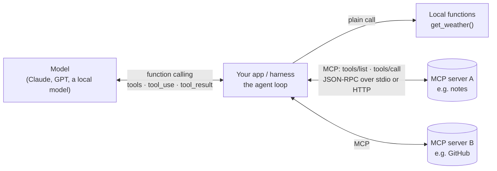
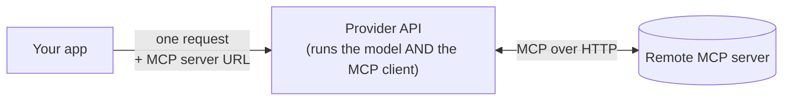

# Function Calling vs. MCP: One Tool, Built Both Ways

People often ask whether MCP replaces function calling. It doesn't. The two work at different layers and are used together:

- **Function calling** (Anthropic calls it *tool use*) is how a **model** asks for a tool. The model reads tool definitions, and instead of answering it replies with a structured request like "call `get_weather` with `{"city": "Paris"}`". Your app runs the function and sends the result back.
- **MCP** (Model Context Protocol) is how an **app** gets tools from somewhere else. A separate server publishes tools, and any MCP client can list them and call them over JSON-RPC.

**Function calling is how the model asks for a tool. MCP is how the tool reaches the app that does the asking.** The model never sees MCP. An MCP tool arrives at the model as an ordinary function-calling tool definition.

This guide builds one small tool, `get_weather`, two ways, and puts the messages each way sends side by side. Read [`claude-tool-use-guide-v2.md`](claude-tool-use-guide-v2.md) (or the [OpenAI version](openai-tool-use-guide.md)) first if `tool_use` and `tool_result` are new to you. [Week 9](../lessons/week9-mcp.md) is where you build the MCP client yourself.

---

## 1. The Two Layers in One Picture



- **Left edge (function calling):** this is between the model and your app. Its format belongs to the provider: Anthropic's `tool_use`, OpenAI's `function_call`.
- **Right edges (MCP):** these are between your app and tool servers. The format is one open standard, the same whichever model you use.
- **The app sits in the middle.** It turns MCP tools into function-calling definitions for the model, and turns the model's tool requests into MCP `tools/call` requests.

---

## 2. Version A: Function Calling Only

Here the tool is a Python function inside your app. You write the definition, run the function and drive the loop yourself:

```python
import json
import anthropic

client = anthropic.Anthropic()

# 1. The function itself: lives in your app.
def get_weather(city: str) -> str:
    fake = {"Paris": "18°C, light rain", "Tokyo": "24°C, clear"}
    return fake.get(city, f"No data for {city}")

# 2. Its definition, written by hand for the model.
tools = [{
    "name": "get_weather",
    "description": "Get the current weather for a city. Use it whenever the user asks about weather.",
    "input_schema": {
        "type": "object",
        "properties": {"city": {"type": "string", "description": "City name, e.g. Paris"}},
        "required": ["city"],
    },
}]

# 3. The loop: the model asks, your code runs, the result goes back.
messages = [{"role": "user", "content": "Do I need an umbrella in Paris today?"}]
while True:
    response = client.messages.create(model="claude-opus-5-5", max_tokens=1024, tools=tools, messages=messages)
    messages.append({"role": "assistant", "content": response.content})
    if response.stop_reason != "tool_use":
        break
    results = []
    for block in response.content:
        if block.type == "tool_use":
            output = get_weather(**block.input)  # your code runs the tool
            results.append({"type": "tool_result", "tool_use_id": block.id, "content": output})
    messages.append({"role": "user", "content": results})

print(response.content[0].text)
```

**Your app owns all of it:** the function, its schema, the dispatch (`get_weather(**block.input)`) and the loop. That is fine for one app, but the tool can't be reused elsewhere. If a second agent or a teammate's IDE wants `get_weather`, they copy the code and the schema. If they use OpenAI, they also rewrite the definition in OpenAI's format.

---

## 3. Version B: the Same Tool as an MCP Server

Move the function into its own process and publish it over MCP. With the official Python SDK (`pip install mcp`, version 2; in 1.x the class was `FastMCP`, imported from `mcp.server.fastmcp`) a server is a few lines:

```python
# weather_server.py: a standalone MCP server (stdio)
from mcp.server.mcpserver import MCPServer

mcp = MCPServer("weather")

@mcp.tool()
def get_weather(city: str) -> str:
    """Get the current weather for a city. Use it whenever the user asks about weather."""
    fake = {"Paris": "18°C, light rain", "Tokyo": "24°C, clear"}
    return fake.get(city, f"No data for {city}")

if __name__ == "__main__":
    mcp.run()  # speaks JSON-RPC on stdin/stdout
```

The SDK builds the JSON Schema from the type hints and the description from the docstring, just as harnessy's `@tool` does (week 3). To see the protocol without any SDK, read [`scripts/mcp_notes_server.py`](../scripts/mcp_notes_server.py): a 130-line server that uses only the standard library.

### The host side: connect, list, convert, loop

Now the app has no `get_weather` code at all. It connects to the server, gets the tool definitions from it, and passes them to the model. In harnessy that takes three lines, because `mcp_tools` (week 9) does the conversion:

```python
from harnessy.loop import Agent
from harnessy.mcp import McpClient, mcp_tools
from harnessy.models.anthropic import AnthropicModel

with McpClient.stdio(["python", "weather_server.py"]) as client:  # start the server, discover its era
    tools = mcp_tools(client, prefix="weather", tags=())            # tools/list → harnessy Tools
    agent = Agent(AnthropicModel(), tools=tools, system="Be brief.")
    print(agent.run("Do I need an umbrella in Paris today?").final_text)
```

Tested against `mcp` 2.3.0 and the reference `solutions/` client: the server answers as the modern era, `mcp_tools` produces one tool named `weather__get_weather`, and calling it returns `18°C, light rain`. To run the server without installing the SDK into the project, use `McpClient.stdio(["uv", "run", "--with", "mcp", "python", "weather_server.py"])`.

`tags=()` says you trust this server because you wrote it. Leave it out for anyone else's server: every MCP tool then carries all three lethal-trifecta tags and needs an approval hook ([week 9 §7](../lessons/week9-mcp.md#7-trust), [`trifecta.md`](trifecta.md)).

**The loop is the same as in Version A.** `Agent.run` still sends tool definitions, still gets back `tool_use`, and still returns `tool_result`. Only the line that runs the tool changed: instead of calling a local function, harnessy's `_caller` sends `tools/call` to the server. Swap `AnthropicModel()` for `OpenAIModel()` and the server keeps working unchanged.

---

## 4. What Actually Crosses the Wire

One question, "Do I need an umbrella in Paris?", followed through both layers. The left column is between the model and the app (function calling). The right column is between the app and the MCP server, in harnessy's modern era; `_meta` is shortened.

**Step 1: describing the tool.** The model receives a tool definition. With MCP, the app got that definition from the server first:

<table>
<tr><th>Function calling: the <code>tools</code> array sent to Claude</th><th>MCP: the server's <code>tools/list</code> result</th></tr>
<tr><td>

```json
{
  "name": "weather__get_weather",
  "description": "Get the current weather for a city...",
  "input_schema": {
    "type": "object",
    "properties": {"city": {"type": "string"}},
    "required": ["city"]
  }
}
```

</td><td>

```json
{"jsonrpc": "2.0", "id": 2, "result": {
  "resultType": "complete",
  "tools": [{
    "name": "get_weather",
    "description": "Get the current weather for a city...",
    "inputSchema": {
      "type": "object",
      "properties": {"city": {"type": "string"}},
      "required": ["city"]
    }
  }]
}}
```

</td></tr>
</table>

Same name, same description, same JSON Schema. Only the field names differ (`input_schema` vs `inputSchema`), and the app adds a prefix (`weather__`) so that two servers' tools can't clash. (A real SDK server also adds `title` keys to the schema. They're left out here.)

**Step 2: calling the tool.** The model asks in its provider's format, and the app forwards the request as `tools/call`:

<table>
<tr><th>Function calling: Claude's response</th><th>MCP: the app's request to the server</th></tr>
<tr><td>

```json
{
  "stop_reason": "tool_use",
  "content": [{
    "type": "tool_use",
    "id": "toolu_01A",
    "name": "weather__get_weather",
    "input": {"city": "Paris"}
  }]
}
```

</td><td>

```json
{"jsonrpc": "2.0", "id": 3,
 "method": "tools/call",
 "params": {
   "name": "get_weather",
   "arguments": {"city": "Paris"},
   "_meta": {"io.modelcontextprotocol/protocolVersion": "2026-07-28", "...": "..."}
 }}
```

</td></tr>
</table>

**Step 3: returning the result.** The server answers with `content` items, and the app turns them into a `tool_result` for the model:

<table>
<tr><th>Function calling: the next user message</th><th>MCP: the server's response</th></tr>
<tr><td>

```json
{"role": "user", "content": [{
  "type": "tool_result",
  "tool_use_id": "toolu_01A",
  "content": "18°C, light rain"
}]}
```

</td><td>

```json
{"jsonrpc": "2.0", "id": 3, "result": {
  "resultType": "complete",
  "content": [{"type": "text", "text": "18°C, light rain"}],
  "isError": false
}}
```

</td></tr>
</table>

### The mapping, field by field

| Function calling (Claude) | MCP | Who translates in harnessy |
| :--- | :--- | :--- |
| `tools[].name` | `tools[].name` (unprefixed) | `tool_name(name, prefix)` |
| `tools[].description` | `tools[].description` (or `title`) | `mcp_tools` |
| `tools[].input_schema` | `tools[].inputSchema` | `clean_schema` |
| `tool_use.input` | `tools/call` `params.arguments` | `_caller` |
| `tool_use.id` ↔ `tool_result.tool_use_id` | JSON-RPC `id` ↔ response `id` | two separate ids, never mixed |
| `tool_result.content` (text) | `result.content[]` (text, image, audio, resources) | `content_to_text` |
| `tool_result.is_error: true` | `result.isError: true` | `McpToolError` → error result |
| A failed request (HTTP 4xx/5xx) | JSON-RPC `error` (protocol error) | `McpError` |

The two ids are worth a second look. `toolu_01A` links the model's request to your result. The JSON-RPC `id` links your request to the server's response. Neither side ever sees the other's id.

---

## 5. Same and Different

**What's the same:**

- **A tool's shape:** a name, a description and a JSON Schema for its inputs. MCP adopted the shape function calling already used, which is why the conversion is nearly mechanical.
- **Who decides:** in both cases the model decides *whether* and *which* tool to call, using only that description and schema.
- **Errors go back to the model:** a tool error should become a result the model can read, so it can try again.

**What's different:**

| | Function calling | MCP |
| :--- | :--- | :--- |
| **What it is** | A feature of a model's API | A protocol between programs |
| **Between** | The model and your app | Your app and tool servers |
| **Format owned by** | Each provider (`tool_use`, `function_call`, …) | One open spec, the same for every model |
| **Where the tool runs** | Wherever your app runs it, usually in-process | In the server's process, locally (stdio) or remotely (HTTP) |
| **Where definitions come from** | Written in your app's code | Fetched at run time with `tools/list` |
| **Reuse** | Copied into each app and rewritten for each provider | Written once, used by any MCP client: Claude Code, IDEs, harnessy |
| **What it offers** | Tools only | Tools, plus resources (data to read), prompts (templates), and more |
| **Trust** | Your own code | Someone else's code and descriptions, so treat it as untrusted |
| **Cost of adding a tool** | Edit the app | Start a server; the app needs no changes |

---

## 6. A Third Path: the Provider Is the MCP Client

So far your app has been the MCP client. Some APIs can also act as the client themselves. Claude's Messages API has an MCP connector, and OpenAI's Responses API has a remote-MCP hosted tool ([OpenAI guide §2](openai-tool-use-guide.md#2-where-tools-run-function-tools-vs-hosted-tools)). You pass a server URL in the request, and the provider calls `tools/list` and `tools/call` on its own side.



This is convenient, but your harness doesn't see the tool calls run, so it can't approve, trace or sandbox them. That only works for remote servers the provider can reach, not for a local stdio server. harnessy keeps the client in your own process for exactly this reason: approvals (week 6), traces (week 5) and the trifecta check (week 7) all need to see the call.

---

## 7. When to Use Which

- **Plain function calling:**
  - the tool belongs to this one app and needs the app's state, such as harnessy's `todo` or `subagent` tools;
  - you want the fewest moving parts and the lowest latency.
- **MCP:**
  - the tool should work in more than one client (your agent, Claude Code, an IDE);
  - someone already publishes a server for it (GitHub, a database, a browser);
  - it needs its own process, language, credentials or machine;
  - you want to add tools without changing the app.
- **Both at once is normal:** harnessy agents mix `@tool` functions and `mcp_tools(...)` in one `tools=[...]` list. Claude Code does the same: its built-in tools are local, and anything from `claude mcp add` comes over MCP ([`claude-code.md`](claude-code.md#week-9-mcp)).

---

## 8. Cheat Sheet

| Question | Answer |
| :--- | :--- |
| Does the model know a tool came from MCP? | No. It sees an ordinary tool definition. |
| Does MCP replace function calling? | No. MCP delivers tools, and function calling is how the model uses them. |
| Who runs an MCP tool? | The MCP server. The app sends `tools/call` and waits for the result. |
| Who runs a plain function tool? | Your app, in its own process. |
| What does the app translate? | `inputSchema` → `input_schema`/`parameters`, `tool_use` → `tools/call`, `content[]` → `tool_result`. |
| Do I need to change the loop to use MCP? | Not if your loop already treats tools generically. Week 9 adds no loop changes. |
| Can I trust an MCP tool's description? | No more than its author. Descriptions go straight into the model's context. |

---

## 9. Where This Lives in harnessy

| Piece | File | Week |
| :--- | :--- | :--- |
| Tool definitions from Python functions (`@tool`) | `harnessy/tools/schema.py` | 3 |
| Turning a `ToolSpec` into Claude/OpenAI format | `harnessy/models/anthropic.py`, `harnessy/models/openai.py` | 1 |
| The MCP client: stdio, eras, `tools/list`, `tools/call` | `harnessy/mcp.py` (`McpClient`) | 9 |
| MCP tool → harnessy `Tool` | `harnessy/mcp.py` (`mcp_tools`, `_caller`, `clean_schema`) | 9 |
| An example MCP server with no SDK | `scripts/mcp_notes_server.py` | 9 |
| The whole thing running | `uv run python -m scripts.week9_demo` | 9 |
| Sequence diagrams of a connection and a call | [`architecture.md` Fig 15–16](architecture.md#mcp-week-9) | 9 |

---

**Next:** [`mcp-under-the-hood.md`](mcp-under-the-hood.md) goes one layer down. It covers the stdio pipes and the JSON-RPC rules that carry every message above, and the problem each one solves.

---

## Sources

- MCP: [specification](https://modelcontextprotocol.io/specification/2026-07-28), [tools](https://modelcontextprotocol.io/specification/2026-07-28/server/tools), [Python SDK](https://github.com/modelcontextprotocol/python-sdk)
- Anthropic: [tool use](https://docs.claude.com/en/docs/agents-and-tools/tool-use/overview), [MCP connector](https://docs.claude.com/en/docs/agents-and-tools/mcp-connector)
- OpenAI: [function calling](https://developers.openai.com/api/docs/guides/function-calling)
- In this repo: [`lessons/week9-mcp.md`](../lessons/week9-mcp.md), [`claude-tool-use-guide-v2.md`](claude-tool-use-guide-v2.md), [`openai-tool-use-guide.md`](openai-tool-use-guide.md)
