# Hooks: changing the loop without editing it

Week 6 adds hooks. This page explains where they fire, what each one can return, how several hooks combine, and the four hooks harnessy already has. It ends with six hooks you can write yourself, each checked against `ScriptedModel`.

> **In one line:** a hook is code the agent loop calls at fixed points in a run, so you can **watch**, **change** or **block** what happens without touching `loop.py`.

## 1. A hook is a class with optional methods

Inherit from `Hook` (`solutions/harnessy/hooks.py`) and override only what you need. Every default method does nothing and returns `None`, and `None` always means "change nothing".

```python
from harnessy.hooks import Hook, Block

class MyHook(Hook):
    def before_tool(self, call):
        if call.name == "delete_everything":
            return Block("No.")
        return None          # every other call runs unchanged
```

Pass it to the agent: `Agent(model, tools=..., hooks=[MyHook()])`.

## 2. Where hooks fire

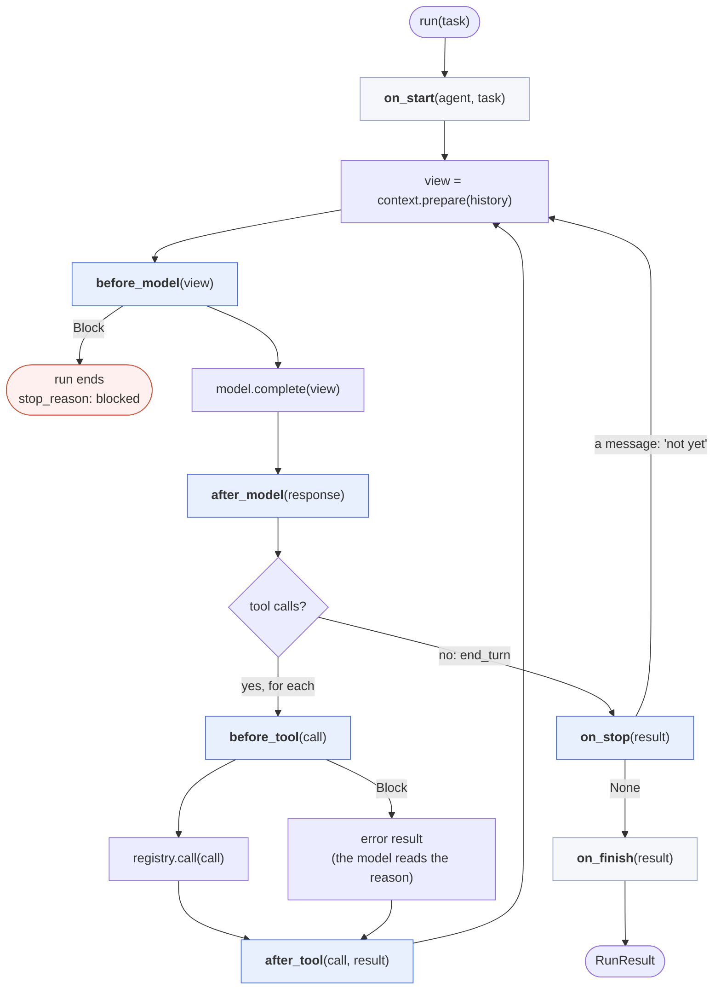

The blue boxes can change what happens; the grey ones only watch. `on_finish` runs however the run ended: after a block, an error or a step limit, too.

| Hook point | Return | Effect |
| --- | --- | --- |
| `on_start(agent, task)` | – | Watch. Reset per-run state here. |
| `before_model(view)` | new view, `Block` or `None` | Change what the model sees. A `Block` **ends the run** (`stop_reason="blocked"`). |
| `after_model(response)` | new response or `None` | Change what the model said. |
| `before_tool(call)` | new call, `Block` or `None` | Change the arguments, or refuse. A `Block` becomes an **error result the model reads**, and the run continues. |
| `after_tool(call, result)` | new result or `None` | Change what the model gets back. |
| `on_stop(result)` | a message or `None` | Turn down "done": the message goes to the model as a user turn. |
| `on_finish(result)` | – | Watch the final result. |

### The two kinds of `Block`

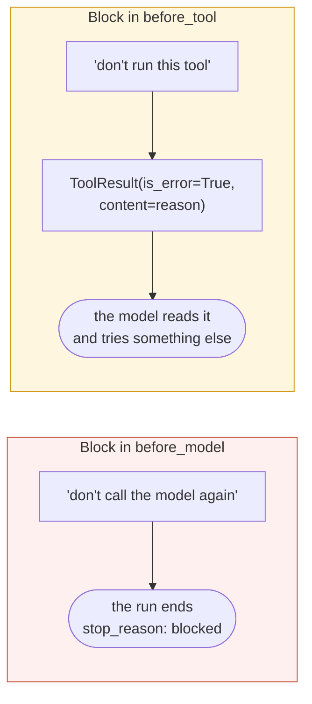

A refused tool call isn't a crash. Like any tool failure since week 3, it's a *result* the model can react to.

## 3. Several hooks: they chain

`HookRunner` runs the hooks in list order:

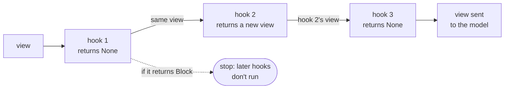

- **One feeds the next.** Each hook gets what the previous one returned. `None` passes the current value along.
- **The first `Block` wins.** In `before_model` and `before_tool`, later hooks don't run.
- **`on_stop`:** the first hook that returns a message wins.
- **Blocked calls still reach `after_tool`,** as error results, so a tracer still records them.

**Order matters.** Put hooks that change things *before* hooks that record them:

```python
hooks=[RedactSecrets(), approvals, TraceHook(tracer)]
#      ^ cleans results  ^ refuses calls  ^ records what really happened, secrets already gone
```

## 4. The four hooks harnessy already has

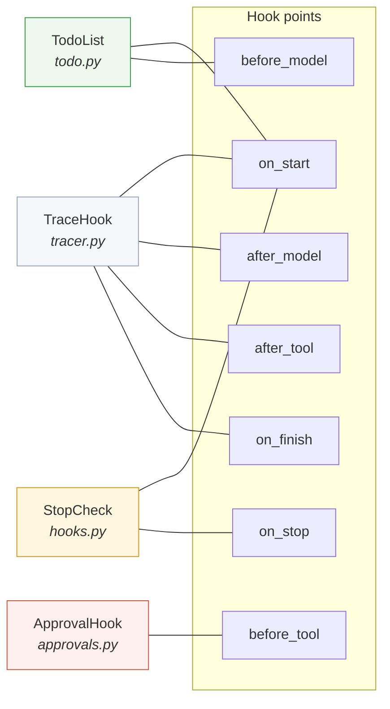

| Hook | What it does | Read more |
| --- | --- | --- |
| **`TraceHook`** | Writes week 5's JSONL trace: `run_start`, `model_call`, `tool_result` and `stop`. It only watches. | [`traces.md`](traces.md) |
| **`ApprovalHook`** | A policy per tool: `allow`, `ask` or `deny`. With `ask`, an approver function decides (for example, y/N in the terminal). | week 6, section 5 |
| **`TodoList`** | Adds the current plan to the end of the view on every call, never to the history. | [`todo.md`](todo.md) |
| **`StopCheck`** | Turns down "done" while `check(result)` returns a message, at most `max_rejections` times (2 by default). | week 6, section 8 |

All four together:

```python
todo = TodoList()
agent = Agent(model,
    tools=[*file_tools(root), todo.tool()],
    hooks=[
        ApprovalHook({"write_file": "ask"}, approver=terminal_approver),  # y/N before each write
        todo,                                                             # the plan in every view
        StopCheck(lambda r: None if (root / "report.md").exists()
                  else "report.md doesn't exist yet."),                   # no "done" without it
        TraceHook(Tracer("run.jsonl")),                                   # record everything
    ])
```

### Why hooks exist

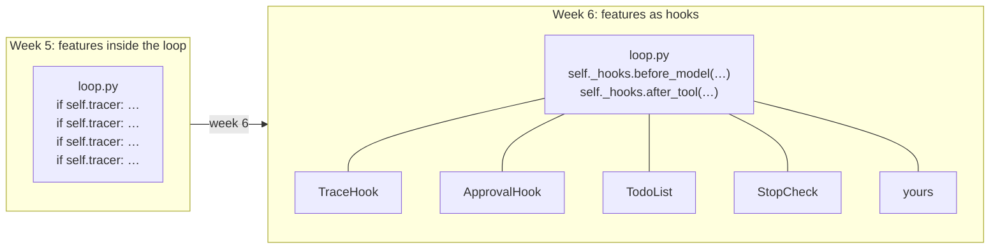

In week 5 you wrote tracing as four `if self.tracer:` blocks inside the loop. Every new feature would have meant more of them. With hooks, the loop calls seven fixed points, and features plug in from outside.

## 5. Six hooks you can write

Each of these was run against `ScriptedModel` with the solution code, and the output under each example is what came back.

```python
import re, time
from dataclasses import replace
from harnessy.hooks import Hook, Block
```

### Example 1: Hide secrets in tool output

`after_tool` changes a result.

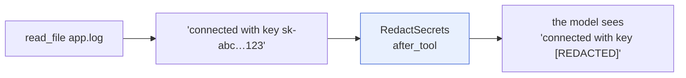

```python
SECRET = re.compile(r"(sk-[A-Za-z0-9_-]{20,}|AKIA[0-9A-Z]{16})")

class RedactSecrets(Hook):
    def after_tool(self, call, result):
        clean = SECRET.sub("[REDACTED]", result.content)
        return replace(result, content=clean) if clean != result.content else None
```

```
model saw:     1	connected with key [REDACTED]
```

The key never reaches the model. It never reaches the trace either, as long as `TraceHook` comes after this hook.

### Example 2: Keep writes inside `drafts/`

`before_tool` changes or refuses a call.

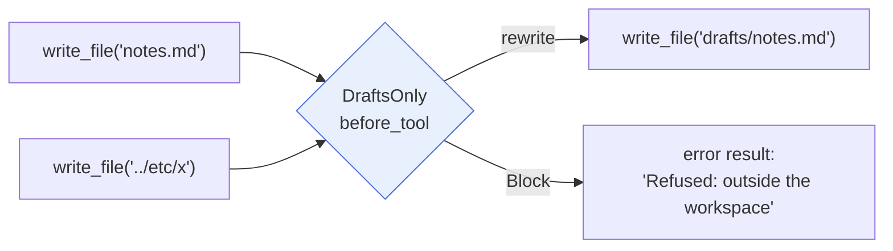

```python
class DraftsOnly(Hook):
    def before_tool(self, call):
        if call.name != "write_file":
            return None
        path = call.arguments.get("path", "")
        if path.startswith("/") or ".." in path:
            return Block(f"Refused: {path!r} is outside the workspace. Use a path under drafts/.")
        if not path.startswith("drafts/"):
            return replace(call, arguments={**call.arguments, "path": f"drafts/{path}"})
        return None
```

```
is_error=False  Wrote 1 characters to drafts/notes.md
is_error=True   Refused: '../etc/x' is outside the workspace. Use a path under drafts/.
```

Quietly rewriting `notes.md` to `drafts/notes.md` is a design choice. You could block it with a message instead, so the model knows where its file went.

### Example 3: A token budget

`after_model` counts and `before_model` stops.

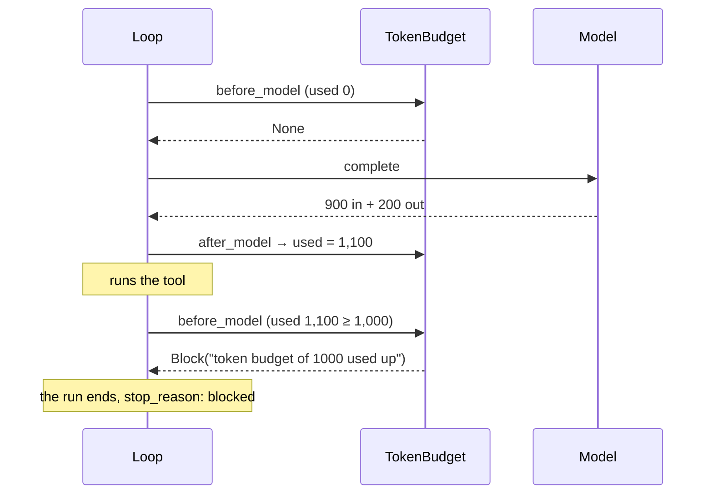

```python
class TokenBudget(Hook):
    def __init__(self, max_tokens):
        self.max_tokens, self.used = max_tokens, 0
    def on_start(self, agent, task):
        self.used = 0
    def after_model(self, response):
        self.used += response.usage.input_tokens + response.usage.output_tokens
    def before_model(self, view):
        if self.used >= self.max_tokens:
            return Block(f"token budget of {self.max_tokens} used up")
```

```
stop_reason=blocked  error='token budget of 1000 used up'  model calls: 1
```

**Reset in `on_start`.** A hook object can be reused across runs, so per-run counters belong in `on_start`. The loop already has `max_tokens_total`, and week 7 adds `max_cost_usd`. This hook shows how such a limit can be built from outside the loop.

### Example 4: Find slow tools

This one only watches.

```python
class ToolTimer(Hook):
    def before_tool(self, call):
        self._t = time.monotonic()
    def after_tool(self, call, result):
        print(f"{call.name}: {time.monotonic() - self._t:.2f}s")
```

```
read_file: 0.00s
```

It returns `None` at both points, so the run is exactly the same with or without it.

### Example 5: "Run the tests before you say done"

`on_stop` turns down "done".

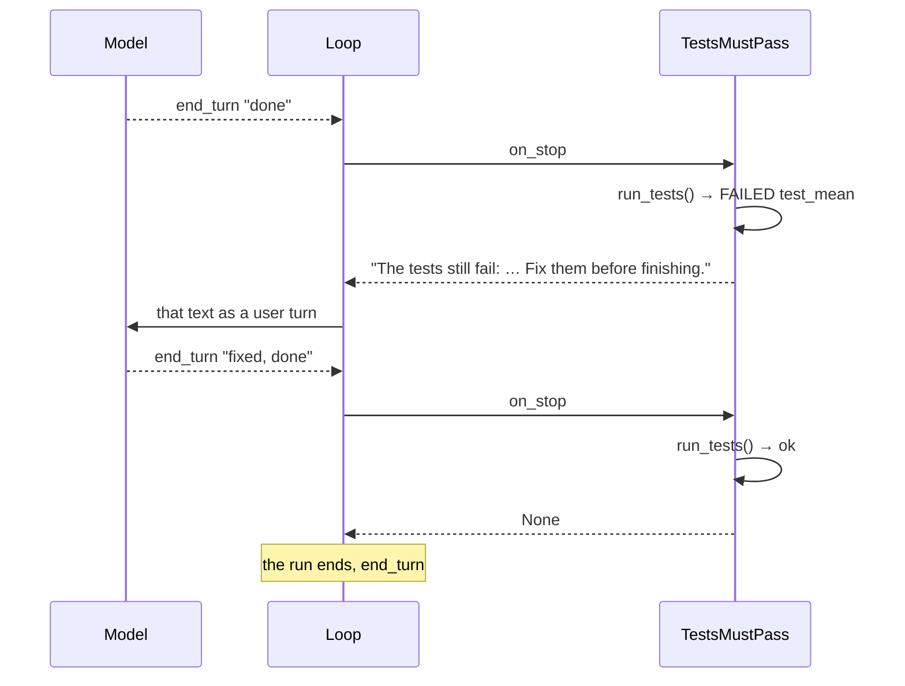

```python
class TestsMustPass(Hook):
    def __init__(self, run_tests):
        self.run_tests = run_tests          # () -> (ok: bool, output: str)
    def on_stop(self, result):
        ok, output = self.run_tests()
        return None if ok else f"The tests still fail:\n{output[-1500:]}\nFix them before finishing."
```

```
stop_reason=end_turn  final_text='fixed, done'  rejection sent: 'The tests still fail:\nFAILED test_mean…'
```

**This one can argue forever.** `StopCheck` caps rejections at 2, but this hand-written version has no cap. Only the loop's own limits (`max_steps`, `timeout`, and the token and cost caps) stop a model that can't make the tests pass. Add a counter, or use `StopCheck(check)` instead.

### Example 6: Add a reminder to every call

`before_model` changes the view, not the history.

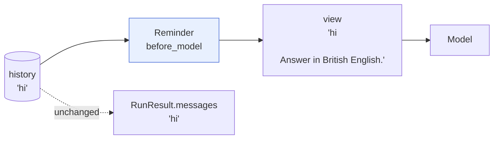

```python
class Reminder(Hook):
    def __init__(self, text):
        self.text = text
    def before_model(self, view):
        last = view[-1]
        return [*view[:-1], replace(last, text=f"{last.text}\n\n{self.text}".strip())]
```

```
view: 'hi\n\nAnswer in British English.'   history: 'hi'
```

This is the same trick `TodoList` uses. Use `dataclasses.replace` and return a *new* list; never edit the messages you were given.

## 6. Testing a hook without spending tokens

`ScriptedModel` replays responses you prepare, so you can check a hook in milliseconds:

```python
from harnessy.models.scripted import ScriptedModel, text_reply, tool_reply
from harnessy.types import ToolCall

model = ScriptedModel([
    tool_reply(ToolCall("c1", "read_file", {"path": "app.log"})),   # step 0: the model asks for a tool
    text_reply("ok"),                                                # step 1: the model is done
])
Agent(model, tools=file_tools(root), hooks=[RedactSecrets()]).run("read the log")

# model.calls[i] is exactly what the model was sent on call i
result_seen = model.calls[1].messages[-1].tool_results[0].content
assert "[REDACTED]" in result_seen
```

Week 6's tests (`tests/week6/test_hooks.py` and `test_wiring.py`) use this same pattern.

## 7. Hook or tool?

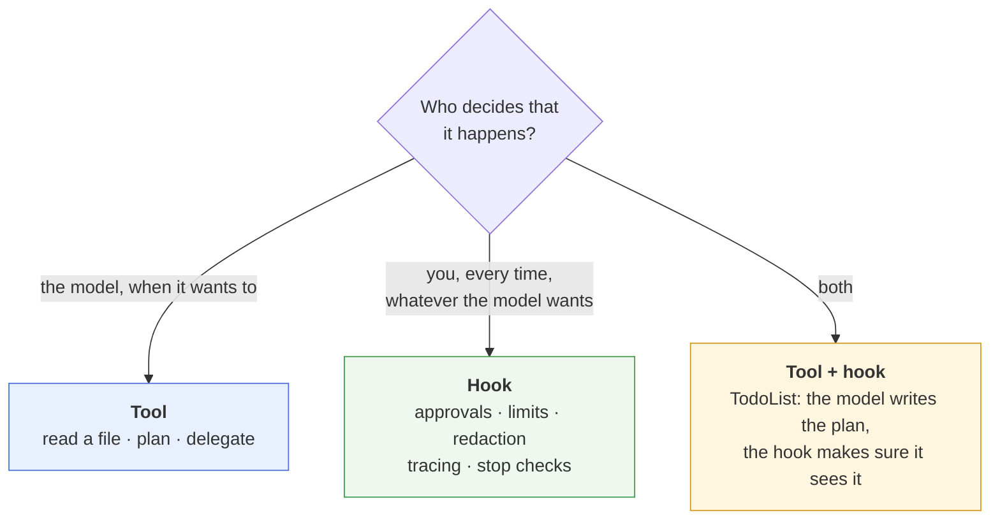

## See also

- `lessons/week6-control-flow.md`, sections 3 to 8, and exercises 6a and 6b
- `solutions/harnessy/hooks.py`, `approvals.py`, `todo.py`, and `TraceHook` in `tracer.py`
- [`docs/todo.md`](todo.md), [`docs/subagents.md`](subagents.md) (pass your hooks down to helpers), [`docs/traces.md`](traces.md)
