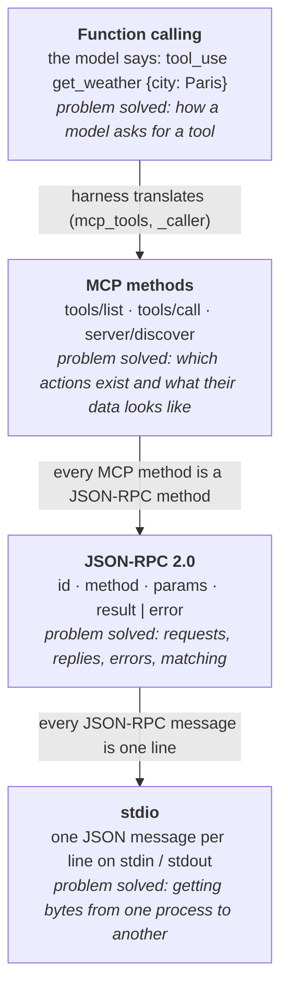
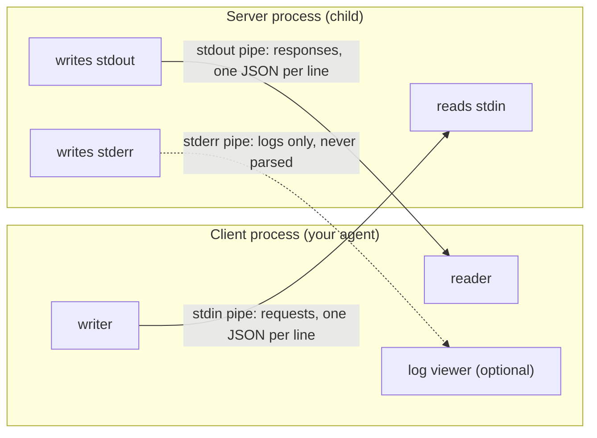
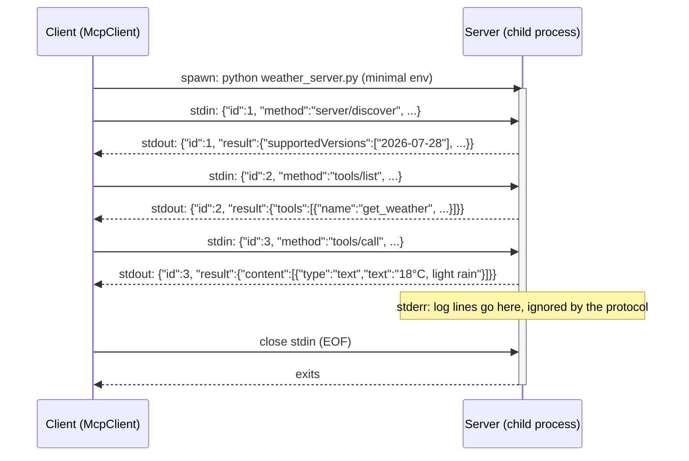
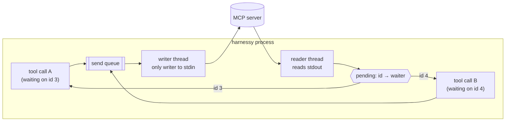
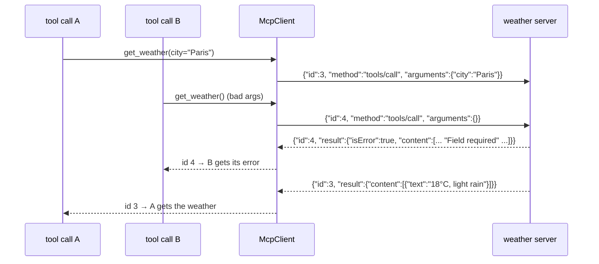
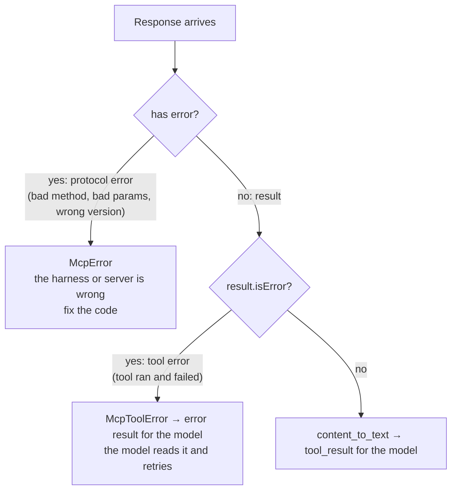
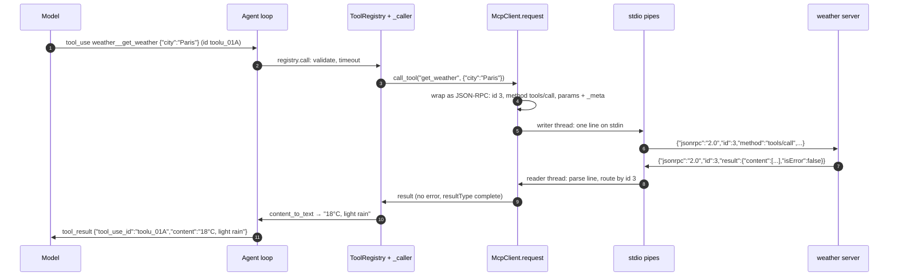

# MCP Under the Hood: stdio and JSON-RPC

[`function-calling-vs-mcp.md`](function-calling-vs-mcp.md) showed *what* MCP does: a server publishes tools, and your app lists and calls them. This guide covers *how* the messages actually get from one program to the other. Two standard pieces do that work:

- **stdio** is the **transport**. It is the pipe between your app and the server.
- **JSON-RPC 2.0** is the **message format**. It is the rules for what each line in that pipe means.

Each part below starts with the problem, then the fix, then what the fix solved. Every JSON example was captured from a real server: the `get_weather` server from the previous guide (built with the official `mcp` 2.3.0 SDK), or harnessy's bundled [`scripts/mcp_notes_server.py`](../scripts/mcp_notes_server.py).

---

## 1. The Stack in One Picture

An MCP tool call passes through four layers. Each one solves one problem and knows nothing about the layers above it:



- **The model** only ever sees the top layer.
- **The server's author** writes tools at the MCP layer. An SDK handles the two layers below.
- **harnessy's week 9 client** implements all three lower layers by hand, which is why it's worth knowing them.

---

## Part 1: stdio, the Transport

### 2. The Problem: Two Programs Need to Talk

Your agent is one program and the MCP server is another, possibly written in a different language by a different person. Before they can exchange any tool calls, they need a channel. The usual answer, a network server, brings a lot with it:

| If the server listened on a port… | …you would need to |
| :--- | :--- |
| Pick a port | avoid clashes with other servers and other copies |
| Start it before the agent | run it as a service, and restart it when it crashes |
| Find it | configure a URL in every client |
| Protect it | add authentication, since any local process (or worse) could connect |
| Stop it | remember to shut it down, or leave it running forever |

For a tool that reads your notes or your git repo, that's a lot of machinery for one user on one machine.

### 3. The Answer: a Child Process and Three Pipes

Every process already has three standard streams: **stdin**, **stdout** and **stderr**. With the stdio transport, the **client starts the server as a child process** and keeps the other end of its pipes:



**The rules** (from the MCP spec's stdio transport):

1. The client **launches** the server, for example `python scripts/mcp_notes_server.py notes.json`.
2. Every message is **one line of JSON** with no newline inside it. The newline marks where one message ends.
3. **stdout carries only protocol messages.** A stray `print("debug")` there corrupts the stream.
4. **stderr is for logs.** The client may show them or ignore them.
5. **Shutdown:** close the server's stdin, wait for it to exit, then terminate it, and kill it if it still hasn't exited.

That's why a server can be this small (the core of `mcp_notes_server.py`):

```python
for line in sys.stdin:                  # rule 2: one message per line
    msg = json.loads(line)
    ...
    sys.stdout.write(json.dumps(reply) + "\n")   # rule 3: only protocol on stdout
    sys.stdout.flush()
```

### 4. A Server's Whole Life



The server starts with your session and goes away with it, so nothing is left running in the background.

### 5. What stdio Solved

| Problem | How stdio solves it |
| :--- | :--- |
| Ports, URLs, discovery | None needed: the client holds the pipes |
| Starting and stopping | Tied to the client: starts on demand, gone when the client exits |
| Who can connect | Only the parent process; nothing listens on the network |
| Secrets leaking to the server | The client chooses the child's environment. harnessy passes only `PATH`, `HOME`, `USER`, locale and `TMPDIR` ([week 9 §7](../lessons/week9-mcp.md#7-trust)) |
| Language lock-in | Anything that reads and writes lines can be a server: Python, Node, Go, Java, a shell script |
| Installing a server | It's just a command line: `claude mcp add notes -- python server.py` |

### 6. Try It by Hand

Because it's just lines, you can be the client yourself. This talks to the bundled notes server in the legacy era, which needs no `_meta` envelope:

```bash
printf '%s\n' \
  '{"jsonrpc":"2.0","id":1,"method":"initialize","params":{"protocolVersion":"2025-11-25","capabilities":{},"clientInfo":{"name":"me","version":"1"}}}' \
  '{"jsonrpc":"2.0","method":"notifications/initialized"}' \
  '{"jsonrpc":"2.0","id":2,"method":"tools/call","params":{"name":"add_note","arguments":{"title":"loop","text":"the agent loop"}}}' \
  '{"jsonrpc":"2.0","id":3,"method":"tools/cal","params":{}}' \
  'not json' \
| python scripts/mcp_notes_server.py /tmp/notes.json
```

Five lines go in, and three come out:

```json
{"jsonrpc": "2.0", "id": 1, "result": {"protocolVersion": "2025-11-25", "capabilities": {"tools": {}}, "serverInfo": {"name": "harnessy-notes", "version": "1.0"}, "instructions": "A small notes store. ..."}}
{"jsonrpc": "2.0", "id": 2, "result": {"content": [{"type": "text", "text": "Saved 'loop'. 1 note in the store."}], "isError": false}}
{"jsonrpc": "2.0", "id": 3, "error": {"code": -32601, "message": "Method not found: tools/cal"}}
```

The notification got no reply, because it has no `id` (§9). The `not json` line was skipped instead of crashing the server. The typo `tools/cal` got a standard error. Part 2 explains each of these.

### 7. What stdio Leaves to the Client

A pipe is simple, but a careful client still has four problems to handle. `StdioTransport` in `harnessy/mcp.py` deals with each one:



| Problem | What would go wrong | harnessy's fix |
| :--- | :--- | :--- |
| **Replies can come back out of order** | A slow call's answer is handed to a fast call (this happened in the capture below) | The reader thread matches each reply to its waiter **by `id`** |
| **A full pipe blocks the writer** | Pipes have a fixed buffer, so a server that stops reading freezes whoever is writing, which would be your agent | A single writer thread does the writing; callers enqueue and wait with their own timeout |
| **Junk on stdout** | A server's stray `print` or a broken byte kills the parser | Lines that aren't valid JSON, or aren't even UTF-8, are skipped |
| **Slow start-up** | The first `npx -y` run downloads the package, and a Java server starts its JVM, so the server looks dead | The version probe waits 10 seconds ([week 9 §4](../lessons/week9-mcp.md#4-two-eras)) |

The shutdown rule matters too. When this capture closed stdin straight after sending its requests, the `mcp` SDK server exited before writing replies to calls still in flight, and those answers were lost. "Close stdin, *wait*, then terminate" gives in-flight work a chance to finish.

### 8. stdio vs. Streamable HTTP

stdio isn't MCP's only transport. Remote servers use **Streamable HTTP**, with one POST per request. JSON-RPC (Part 2) is the same on both, so only the pipe changes:

| | stdio | Streamable HTTP |
| :--- | :--- | :--- |
| Where the server runs | Your machine, as a child process | Anywhere with a URL |
| Who starts it | The client | Someone else; it's already running |
| Clients per server | One | Many |
| Authentication | Not needed (it's your process) | Needed (OAuth, tokens) |
| Good for | Files, git, local databases, your own tools | Hosted services (GitHub, Slack), shared team servers |
| In harnessy | `StdioTransport` (given, week 9) | A stretch exercise in week 9 |

---

## Part 2: JSON-RPC, the Message Format

### 9. The Problem: JSON Is Only Data

stdio delivers lines, and JSON makes each line parseable. But JSON only says how to *write* data, not what a message *means*. Imagine MCP had used bare JSON:

```json
→ {"tool": "get_weather", "city": "Paris"}
← {"text": "18°C, light rain"}
```

It works for one call. Then real use raises five questions that bare JSON can't answer:

1. **Which question is this the answer to?** Two calls are in flight. Which one does `{"text": ...}` belong to?
2. **Is this a request, a reply, or an announcement?** Servers also send unprompted messages, such as "my tool list changed".
3. **Did it work?** Is `{"text": "not found"}` a result or an error?
4. **What's the action?** Is it under `"tool"`, `"action"` or `"cmd"`? Every server would choose differently.
5. **What if the message itself is broken?** Unparseable JSON, an unknown action, missing fields: how does a server say so in a way every client understands?

If every client and server made up their own answers, nothing would work together, and that is exactly what MCP exists to prevent.

### 10. The Answer: Four Small Rules

[JSON-RPC 2.0](https://www.jsonrpc.org/specification) is a one-page spec that answers all five questions. Every MCP message is a JSON-RPC message.

**A request** has an `id`, a `method` (the action) and `params` (the data):

```json
{"jsonrpc": "2.0", "id": 3, "method": "tools/call",
 "params": {"name": "get_weather", "arguments": {"city": "Paris"}, "_meta": {"...": "..."}}}
```

**A response** carries the **same `id`** and exactly one of `result` or `error`:

```json
{"jsonrpc": "2.0", "id": 3, "result": {"content": [{"type": "text", "text": "18°C, light rain"}], "isError": false}}
{"jsonrpc": "2.0", "id": 3, "error": {"code": -32601, "message": "Method not found: tools/cal"}}
```

**A notification** has **no `id`**. That alone means "don't reply":

```json
{"jsonrpc": "2.0", "method": "notifications/initialized"}
```

**Errors use standard codes**, so every program recognises them:

| Code | Meaning | Seen in this guide |
| :--- | :--- | :--- |
| `-32700` | Parse error: not valid JSON | |
| `-32600` | Invalid request | |
| `-32601` | Method not found | `tools/cal` (§6) |
| `-32602` | Invalid params | a missing `_meta` envelope (§13) |
| `-32603` | Internal error | |
| other | Defined by the protocol on top | MCP's `-32022`: unsupported protocol version |

### 11. The `id` in Action: a Real Out-of-Order Reply

This was captured from the `get_weather` server, sending two calls back to back: `id 3` (a valid call) and `id 4` (missing `city`). **The server answered `id 4` first**:



Without the `id`, the client would have given "Field required" to call A and the weather to call B, and nothing would have flagged the mix-up. Calls do overlap in harnessy: a tool the registry gave up on keeps running, and subagents run their own tools.

### 12. Two Kinds of Failure

Because JSON-RPC owns the question "did the *request* work?", MCP can keep a second question separate: "did the *tool* work?" The capture shows both:

```json
{"jsonrpc":"2.0","id":5,"error":{"code":-32602,"message":"params._meta must be an object carrying the required 'io.modelcontextprotocol/protocolVersion' ... envelope keys"}}
{"jsonrpc":"2.0","id":4,"result":{"content":[{"type":"text","text":"Error executing tool get_weather: 1 validation error ... city Field required"}],"isError":true}}
```



- **Protocol error:** the request itself was broken, so the problem is in your code (or the server's). The model can't fix it.
- **Tool error:** the request was fine but the tool failed. The model *can* fix this, for example by passing `city`, exactly like week 3's error results.

With bare JSON these two would be mixed together.

### 13. What JSON-RPC Solved

| Question from §9 | JSON-RPC's answer | Where it shows up in harnessy |
| :--- | :--- | :--- |
| Which question is this the answer to? | `id`, copied into the reply | `StdioTransport`'s reader thread routes replies by `id` |
| Request, reply or announcement? | Has `method`+`id` → request; has `result`/`error` → reply; no `id` → notification | `mcp_notes_server.py`: `if mid is None: continue` |
| Did it work? | `result` *or* `error`, never both | `request()` raises `McpError` or returns `result` |
| What's the action? | `method` | MCP is mostly a list of method names: `tools/list`, `tools/call`, `server/discover` |
| What if the message is broken? | Standard error codes | `-32601` for the typo; `-32022` drives `connect()`'s era detection |

It also gives two things for free:

- **Both directions:** a server can send *its own* requests to the client, such as asking for user input mid-task (`input_required`, a week 9 stretch exercise).
- **Any transport:** the same message works as a line on stdio or the body of an HTTP POST.

### 14. Why Not Invent Something New?

JSON-RPC is old, tiny and widely supported: libraries exist in every language, and the spec fits on one page. The Language Server Protocol, which every IDE uses to talk to language tools, is built on the same JSON-RPC base, and MCP followed that design. So the MCP spec doesn't define requests, replies, errors or matching at all. It only defines **which methods exist** and **what their `params` and `result` look like**.

---

## 15. Putting It Together: One Call, Every Layer

Here is the `get_weather` call from [`function-calling-vs-mcp.md`](function-calling-vs-mcp.md), followed from the model down to the pipe and back:



| Steps | Layer | The id in play |
| :--- | :--- | :--- |
| 1, 11 | Function calling | `toolu_01A`: links the model's request to your result |
| 2–3, 9–10 | harnessy (registry, `_caller`) | none: plain Python calls |
| 4, 8 | JSON-RPC | `3`: links your request to the server's reply |
| 5–7 | stdio | none: just bytes and newlines |

Neither id ever crosses into the other layer. The model never sees `3`, and the server never sees `toolu_01A`.

---

## 16. Cheat Sheet

| Question | Answer |
| :--- | :--- |
| What is stdio? | A process's standard input, output and error streams. MCP's stdio transport runs the server as a child process and exchanges one JSON message per line. |
| What does stdio save me? | Ports, URLs, auth, service management. The server lives and dies with the client. |
| Golden rule for stdio servers | Only protocol messages on stdout. Logs go to stderr. |
| What is JSON-RPC? | Rules on top of JSON: `id`, `method`, `params`, `result` or `error`; no `id` means notification. |
| Why not plain JSON? | Plain JSON can't match replies to requests, tell errors from results, or mark notifications. |
| Protocol error vs tool error? | JSON-RPC `error` = the request was broken (`McpError`). `result.isError` = the tool failed and the model should see it (`McpToolError`). |
| Are the model's id and the JSON-RPC id the same? | No. `tool_use.id` is for the model; the JSON-RPC `id` is for the server. |
| Does any of this change for HTTP? | JSON-RPC stays the same; only the transport changes. |

---

## 17. Where This Lives in harnessy

| Piece | File | Week |
| :--- | :--- | :--- |
| Spawning the server, the pipes, writer and reader threads, shutdown | `harnessy/mcp.py` (`StdioTransport`, given) | 9 |
| JSON-RPC requests, `_meta`, `McpError` | `harnessy/mcp.py` (`McpClient.request`, exercise 9b) | 9 |
| Era detection from error codes (`-32022`) | `harnessy/mcp.py` (`connect`, exercise 9b) | 9 |
| A server written with only the standard library | [`scripts/mcp_notes_server.py`](../scripts/mcp_notes_server.py) | 9 |
| Seven kinds of misbehaving server, for tests | `tests/week9/fake_server.py` | 9 |
| Connection and call sequence diagrams | [`architecture.md` Fig 15–16](architecture.md#mcp-week-9) | 9 |

---

## Sources

- MCP: [stdio transport](https://modelcontextprotocol.io/specification/2026-07-28/basic/transports/stdio), [specification overview](https://modelcontextprotocol.io/specification/2026-07-28), [tools](https://modelcontextprotocol.io/specification/2026-07-28/server/tools)
- [JSON-RPC 2.0 specification](https://www.jsonrpc.org/specification)
- In this repo: [`function-calling-vs-mcp.md`](function-calling-vs-mcp.md), [`lessons/week9-mcp.md`](../lessons/week9-mcp.md)
