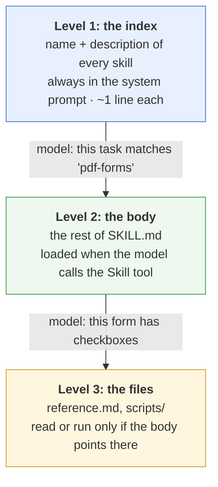
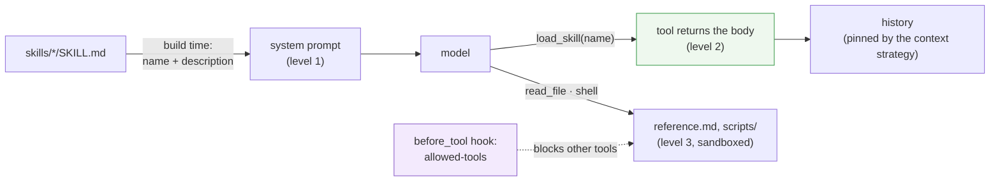
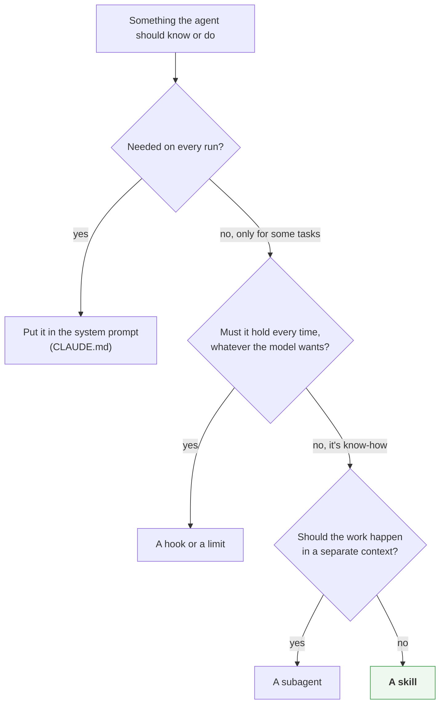

# Skills: instructions the agent loads when it needs them

Claude Code has *skills*: folders of instructions that the agent loads only when a task needs them. Harnessy doesn't have skills, and this page doesn't add them. It explains how they work, then shows that every part of a skill fits into a plug-in point you have already built. **The loop doesn't change.**

> **In one line:** a skill is a description that the model can always see, plus a body it loads by calling a tool. The **model** decides when a skill is relevant. The **harness** decides which skills exist, keeps the loaded instructions in view, and enforces any rules the skill declares.

## 1. What a skill is

A skill is a folder with a `SKILL.md` file in it:

```
.claude/skills/pdf-forms/
├── SKILL.md          ← frontmatter (name, description) + instructions
├── reference.md      ← extra detail, read only if needed
└── scripts/fill.py   ← code the agent can run
```

```markdown
---
name: pdf-forms
description: Fill in PDF forms. Use when the user asks to complete or extract fields from a PDF.
---
1. Run `scripts/fill.py --list form.pdf` to see the field names.
2. Write the values to a JSON file, then run `scripts/fill.py form.pdf values.json`.
3. If a field is a checkbox, read reference.md first.
```

The frontmatter is the skill's *advertisement*. Everything under it is the *manual*, which the model reads only when it decides it needs it.

## 2. Progressive disclosure: three levels

The point of a skill is that it doesn't cost context until it's used.



| Level | What the model sees | When | Context cost |
| --- | --- | --- | --- |
| 1. Index | `name` and `description` | always | about one line per skill |
| 2. Body | the rest of `SKILL.md` | the model calls the `Skill` tool, or you type `/pdf-forms` | one tool result |
| 3. Files | `reference.md`, `scripts/` | the body points there and the model reads or runs them | ordinary file and shell calls |

Two consequences:

- **You can install fifty skills and pay for fifty lines.** Compare `CLAUDE.md`, which is loaded in full on every run.
- **The description is everything.** The model picks a skill by matching the task against descriptions. A vague description ("PDF helper") means the skill is never used. A good one says *what* the skill does and *when* to use it.

## 3. How a skill compares with the other extension points

| | Loaded | Enforced? | Its own context? | Harnessy equivalent |
| --- | --- | --- | --- | --- |
| `CLAUDE.md` | always | no | no | `system` |
| **Skill** | on demand | no, it's advice | no, it runs in the main loop | *(this page)* |
| Subagent | on demand | no | **yes** | `subagent_tool` ([subagents.md](subagents.md)) |
| Hook | n/a | **yes** | n/a | `Hook` ([hooks.md](hooks.md)) |
| MCP server | its tools always listed | no | no | `mcp` (week 9) |

The difference that matters most is between a skill and a subagent. A skill's instructions join *your* context, so the agent follows them with everything it already knows. A subagent gets a *fresh* context and returns only its answer. Use a skill to teach the agent how to do something. Use a subagent to hand work off.

## 4. Skills in harnessy, piece by piece

Each part of a skill lands on one of the five plug-in points from [`what-is-a-harness.md`](what-is-a-harness.md#3-five-places-to-plug-in).



| Part of a skill | Plug-in point | Built in week |
| --- | --- | --- |
| Finding skills and reading their frontmatter | setup code, before `Agent(...)` | — |
| Level 1: the index | `system` | 2 |
| Level 2: loading the body | a tool, `load_skill` | 3 |
| Level 3: reference files and scripts | `file_tools`, `shell_tool` | 3, 7 |
| Keeping the body in view | a context strategy | 4 |
| Seeing which skill was used | `TraceHook`, evals | 5 |
| `allowed-tools` | a `before_tool` hook | 6 |
| Skills from someone else | the trifecta tags | 7 |

### Discovery and the index (level 1)

Before building the agent, scan a `skills/` folder, read each `SKILL.md` frontmatter and add one line per skill to the system prompt:

```
You have these skills. Call load_skill with a name to load its full instructions
before you start a task that matches one.
- pdf-forms: Fill in PDF forms. Use when the user asks to complete or extract fields from a PDF.
- changelog: Write release notes from git history. Use when asked for a changelog.
```

This is plain setup code. The loop never knows skills exist.

### Loading the body (level 2): a tool, not a hook

Loading a skill is the model's choice, so by the course's first rule it's a tool. A sketch, **not in harnessy**, using the week 3 `@tool` decorator:

```python
def skill_tool(skills: dict[str, Path]) -> Tool:
    @tool
    def load_skill(name: str) -> str:
        """Load the full instructions for one of your skills. Call it before starting a task the skill covers."""
        if name not in skills:
            raise ValueError(f"no skill named {name!r}; you have: {', '.join(skills)}")
        return (skills[name] / "SKILL.md").read_text()   # frontmatter included; the model can ignore it
    return load_skill
```

An unknown name raises an error, and the week 3 registry turns that into an error result, so the model can see its mistake and try again. Typing `/pdf-forms` skips the tool altogether: the harness puts the body in the first user message before the run starts, because that's *your* choice and not the model's.

### Reference files and scripts (level 3): tools you already have

The body tells the model to read `reference.md` or run `scripts/fill.py`. It does that with `file_tools` and `shell_tool`, so nothing new is needed. The scripts run through `run_command`, so they get the timeout, the scrubbed environment and the output cap automatically ([sandbox.md](sandbox.md)). Point `file_tools` at a root that includes the skills folder, or give the model a second, read-only set of file tools for it.

### Keeping the instructions in view (week 4): the interesting problem

The body arrives as a tool result, so it is ordinary history. On a long run, `DropOldest` cuts the oldest messages first, and the skill the agent is following could be among them. The agent would then carry on without its instructions, and nothing would tell you.

The fix is a context strategy that **pins** loaded skills: when it cuts, it keeps any tool result from `load_skill`, the same way `DropOldest` already keeps `messages[0]`, the task. `Summarize` has the same issue, because a summary of a checklist is not the checklist. This is a good place to use the week 4 tests: build a long run and assert that the body is still in the view at the end.

### Watching and measuring (week 5)

`load_skill("pdf-forms")` is a tool call, so it appears in every trace without any extra work. That makes descriptions testable. Write eval tasks that should and shouldn't trigger each skill, and grade whether the right one was loaded. If a skill is never picked, fix its description before you change its body.

### `allowed-tools` (week 6): advice becomes a rule

A Claude Code skill can list `allowed-tools` in its frontmatter. Text in the body is only advice, so if the skill must *only* use certain tools, that has to be a hook. A `before_tool` hook notices a `load_skill` call, records that skill's allowed tools, and returns a `Block` for any other tool until the run ends. This is the second rule from [`what-is-a-harness.md`](what-is-a-harness.md): a rule that must hold every time goes in a hook, never only in the prompt.

### Skills from someone else (week 7)

A skill is instructions that go straight into the model's context. A skill you didn't write is untrusted input: a malicious `SKILL.md` is a prompt injection you installed yourself. It can also ship scripts. Treat it the way week 7 treats a web page:

- Tag `load_skill` with `untrusted_input` when skills come from outside your repo, so `check_trifecta` refuses to build an agent that also reads private data and can send it out ([trifecta.md](trifecta.md)).
- Read a third-party skill's files before you install it, the same way you would read a script before running it.

### One agent, many skills (week 8)

Week 8 builds a research, a code and a data agent from the same `Agent`: each is a system prompt, tools and limits. Skills go one step further. The three agents could be **one** agent with three skills, loading whichever the task needs. That is "an agent is just configuration" with the configuration loaded on demand.

## 5. When to make something a skill



## 6. Exercises

These are thought exercises. Each one asks for a design, not code.

1. **Write a description.** Pick a task you do often and write a skill description for it. Then write three task prompts that should trigger it and two that shouldn't. Would the model tell them apart from the description alone?
2. **Find the dropped skill.** With `DropOldest` and a small context budget, at which step would a skill loaded at step 1 disappear from the view? Which rule would you add to the strategy to keep it?
3. **Skill or subagent?** "Review this diff for security issues" could be either. List what changes if it's a skill and what changes if it's a subagent: context, cost, what the parent sees.
4. **Trace a skill in Claude Code.** Use a skill in Claude Code, then find the `Skill` tool call in the session's JSONL transcript under `~/.claude/projects/` ([claude-code.md](claude-code.md)). What did the tool result contain?

## See also

- [`what-is-a-harness.md`](what-is-a-harness.md): the five plug-in points
- [`subagents.md`](subagents.md): the other "just a tool" extension
- [`hooks.md`](hooks.md): turning a skill's rules into enforcement
- [`claude-code.md`](claude-code.md): the rest of the harnessy ↔ Claude Code map
