# Subagents: who decides, and how

Week 6 adds `spawn_subagent`. This page explains how an agent ends up launching one, which levers you have over that choice, and six ways to use it.

> **In one line:** the **model** decides to delegate, the same way it decides to call any tool. The **harness** decides whether the tool exists, what the helper may do, and whether a delegation may run.

## 1. A subagent is just a tool

There's no planner in harnessy that looks at a task and splits it. `subagent_tool(model, tools)` (`solutions/harnessy/subagents.py`) returns an ordinary `Tool`. The model sees it next to `read_file` and the others, and calls it the same way.

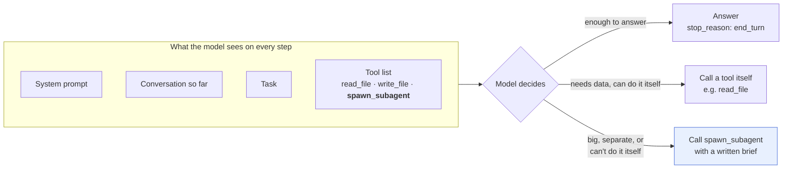

This is what the model reads about the tool. It comes from the function's signature and docstring:

```json
{
  "name": "spawn_subagent",
  "description": "Hand a self-contained sub-task to a helper agent with a fresh context. It returns only its final answer.",
  "input_schema": {
    "type": "object",
    "properties": {
      "task":  {"type": "string", "description": "Everything the helper needs to know: it can't see this conversation."},
      "tools": {"type": "array", "items": {"type": "string"}, "description": "Names of the tools the helper may use (default: all of them)."}
    },
    "required": ["task"]
  }
}
```

The sentence *"it can't see this conversation"* matters. It's what makes the model write a complete brief in `task`, instead of "summarize the files we talked about".

## 2. What happens when it delegates

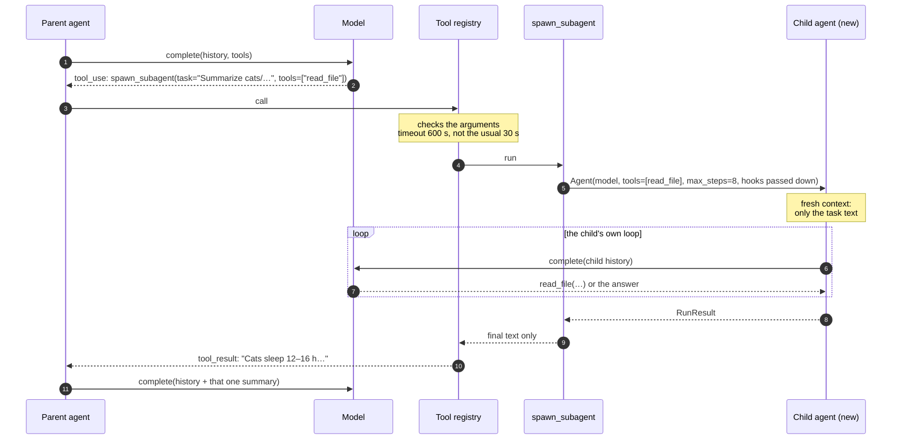

Some details:

| | |
| --- | --- |
| **What the parent gets back** | Only the child's final text. If the child stopped early: `The subagent stopped early (max_steps). Partial answer: …` |
| **What the child starts with** | Only the `task` string, its own system prompt, the tools it was given, and the hooks passed down. |
| **A wrong tool name** | `tools=["grep"]` when there's no `grep` raises an error. The model sees `unknown tools: grep. Available: read_file` and retries. |
| **Several helpers in one turn** | If the model asks for two at once, harnessy runs them one after the other, not in parallel. |
| **Tracing** | The child isn't traced. The parent's trace shows one `tool_result` holding the summary. |
| **Cost** | The child's tokens don't reach the parent's `usage`. That's week 6's question 2. |

## 3. Why bother: the parent's context stays small

Every step resends the whole history. So whatever a helper reads but doesn't send back is paid for once, in the helper, instead of on every later step of the parent.

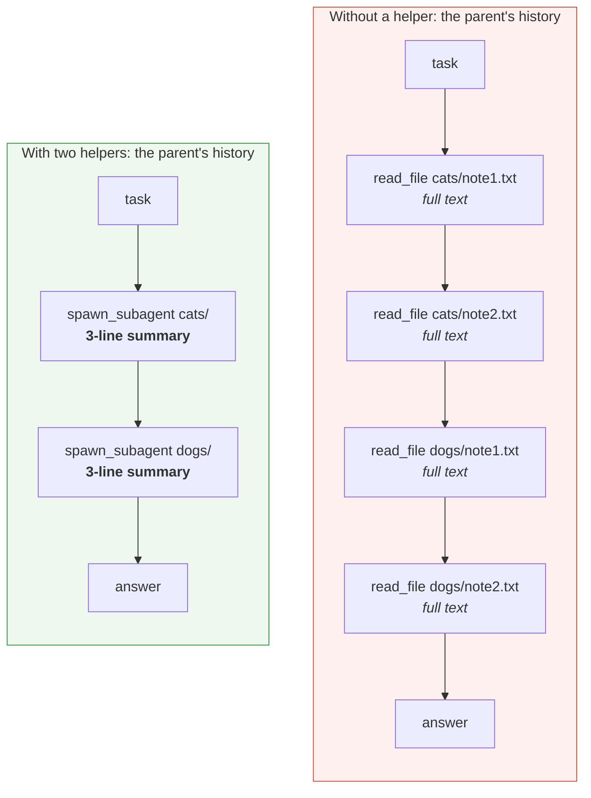

With four short notes it makes little difference. With 50 log files it's the difference between a parent that fits in its context and one that doesn't.

## 4. The levers

You can't force the call through the API. The newest Claude models reject `tool_choice: any/tool`, and harnessy doesn't expose `tool_choice` anyway. You steer the model instead.

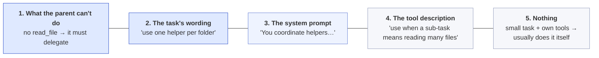

The levers on the left are the strongest. Doing nothing (the last box) is fine: for a small job, reading the file itself is cheaper than starting a whole agent, and the model usually knows that.

**To limit or stop delegation:**

| You want | Use |
| --- | --- |
| No delegation | Don't give the tool. |
| Refuse it, but let the model carry on | `ApprovalHook({"spawn_subagent": "deny"})`. The model gets a refusal and works around it. |
| A human approves each one | `ApprovalHook({"spawn_subagent": "ask"})` (the week 8 research agent). |
| Short helpers | `subagent_tool(..., max_steps=8)` |
| Helpers that follow the parent's rules | `subagent_tool(..., hooks=[guard])`. **Always do this** when the helper has a risky tool. |

## 5. Six ways to use it

The first two run as they are. Examples 3 to 6 are sketches: they leave the setup and tasks to you.

### Example 1: Splitting one job across several helpers (the week 6 demo)

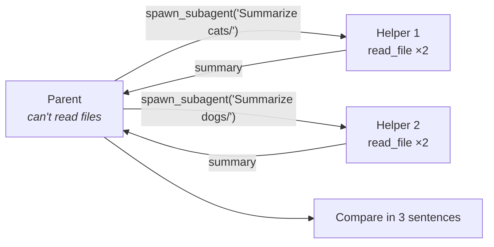

```python
readers = [t for t in file_tools(root) if t.name == "read_file"]
parent = Agent(model,
    tools=[subagent_tool(model, readers)],
    system="You coordinate helpers. You can't read files yourself: give each helper one folder and ask for a summary.")
parent.run("cats/ and dogs/ each hold note1.txt and note2.txt. "
           "Use one helper per folder, then compare them in three sentences.")
```

**What makes it delegate:** levers 1, 2 and 3 together. It has no `read_file` of its own, the task says "one helper per folder", and the system prompt says it coordinates helpers.

Run it: `uv run python -m scripts.week6_demo`

### Example 2: Keeping noisy work out of the parent's context

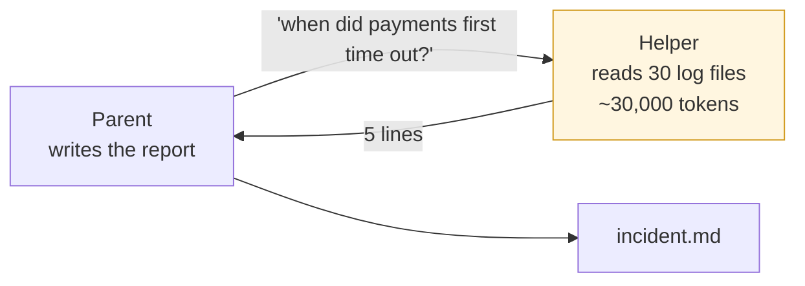

```python
parent = Agent(model,
    tools=[subagent_tool(model, file_tools(logs_dir), max_steps=20), *report_tools],
    system="Never read logs yourself. Send log searches to a helper and ask for at most five lines back.")
parent.run("Find when the payment service first timed out yesterday, then write incident.md.")
```

**When to use it:** whenever the work is large but the answer is small. Searching logs, reading a long spec for one limit, or scanning a codebase for one function all fit.

### Example 3: A read-only reviewer

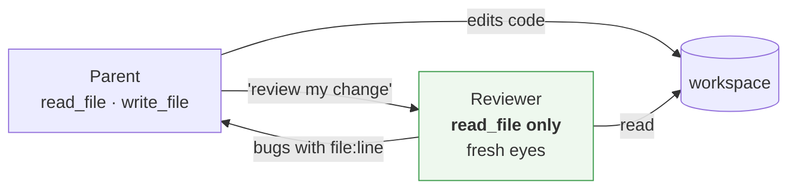

```python
files = file_tools(root)
reader_only = [t for t in files if t.name == "read_file"]
parent = Agent(model,
    tools=[*files, subagent_tool(model, reader_only,
        system="You review code. Report bugs with file and line. You cannot change files.")],
    system="After you edit code, ask a helper to review it before you finish.")
```

**Why it helps:** the reviewer can't "fix" anything quietly. Because it starts with a fresh context, it also doesn't share the parent's assumptions about the code.

### Example 4: A safe helper in a risky agent (week 8 research)

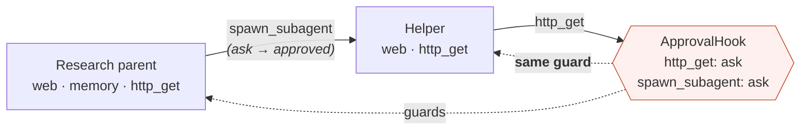

```python
guard = ApprovalHook({"http_get": "ask", "spawn_subagent": "ask"}, approver=research_approver(web))
tools = [*readers, *memory_tools(store),
         subagent_tool(model, readers, hooks=[guard], max_steps=8)]
Agent(model, tools=tools, hooks=[guard], ...)
```

**The point is `hooks=[guard]` on the helper.** Without it, a parent whose `http_get` is guarded could hand the same request to a helper with no guard and get around its own policy. `spawn_subagent` also inherits `http_get`'s trifecta tags, so week 7's check sees the risk too.

### Example 5: A cheaper model for the helpers

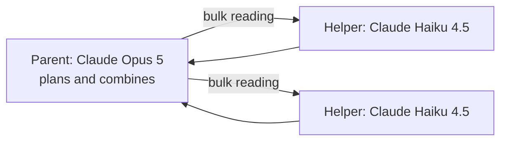

```python
cheap = AnthropicModel("claude-haiku-4-5")
parent = Agent(AnthropicModel("claude-opus-5"), tools=[subagent_tool(cheap, readers)], ...)
```

`subagent_tool` takes its own `model`, so a strong model can plan while a cheaper one does the reading.

### Example 6: When *your code* decides: a workflow, not an agent

If you already know the split ("summarize each of these 20 files"), the model doesn't need to decide anything.

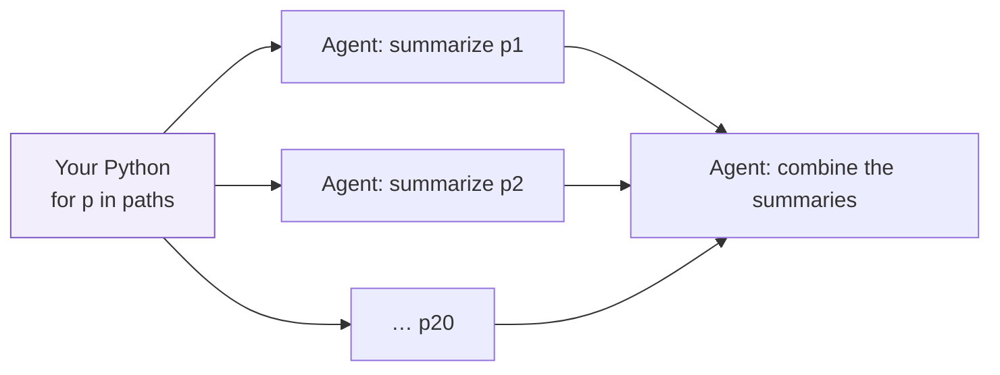

```python
summaries = {p: Agent(model, tools=readers, system=SUBAGENT_SYSTEM).run(f"Summarize {p}.").final_text
             for p in paths}
final = Agent(model, tools=[]).run("Combine these summaries:\n" + json.dumps(summaries))
```

**What it gets you:** this is cheaper and gives the same split every time. You can also run the children in parallel with a thread pool.

## 6. Should this be a subagent?

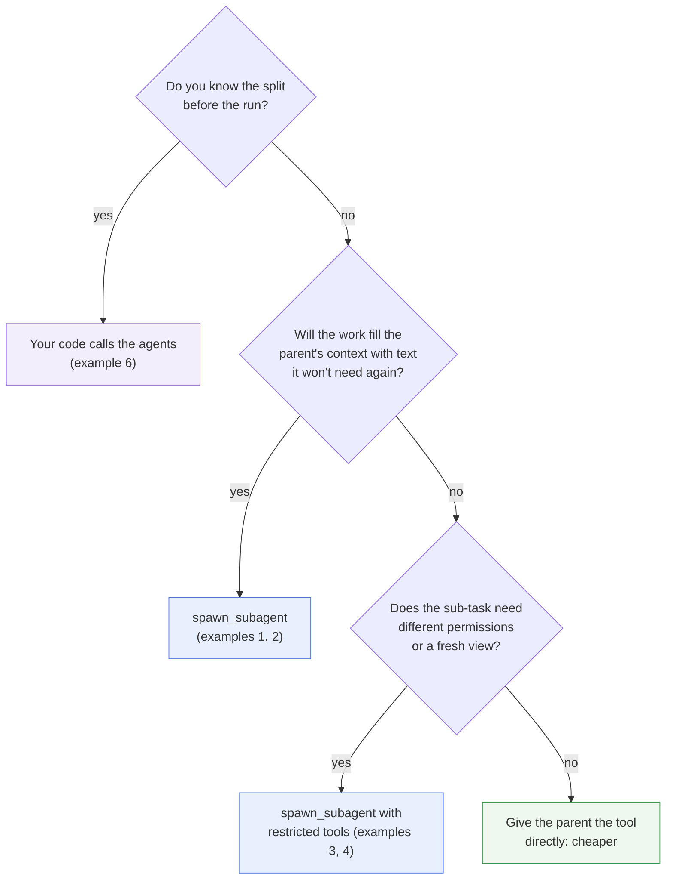

**The cost:**
- Every helper is a whole agent run, with its own system prompt, tool definitions and steps.
- Anthropic measured multi-agent research at about 15× the tokens of a plain chat.

**When to skip it:** if the task is small, or the parent needs the raw details later (exact file contents to edit, say), delegation costs more and loses information.

## See also

- `lessons/week6-control-flow.md`, section 6, and exercise 6c (`tests/week6/test_subagents.py`)
- [Fig 10 in `docs/architecture.md`](architecture.md#fig-10-subagents)
- `scripts/week6_demo.py`, part 2
- [How we built our multi-agent research system](https://www.anthropic.com/engineering/multi-agent-research-system) (Anthropic)
