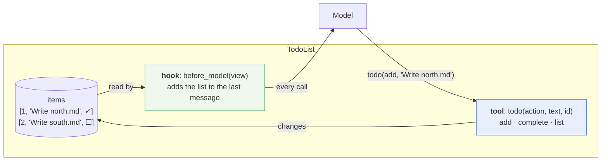
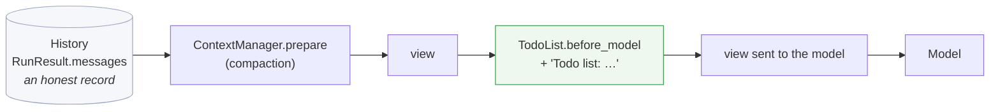
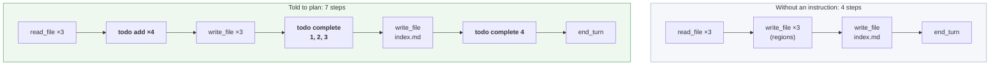
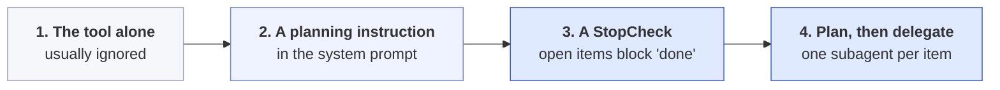
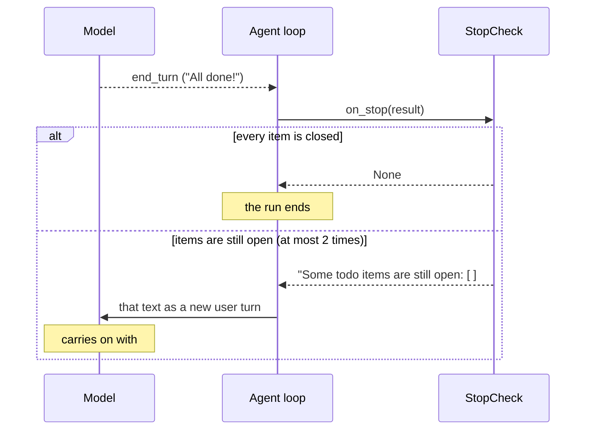
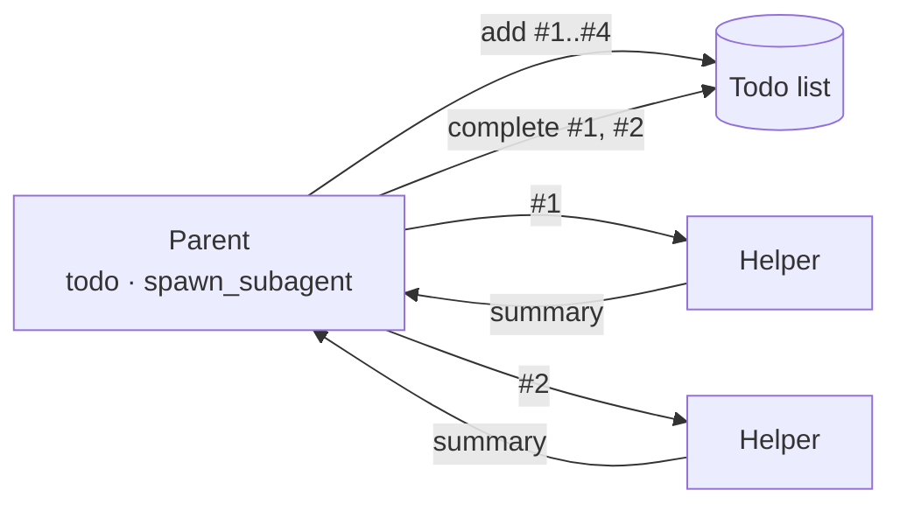
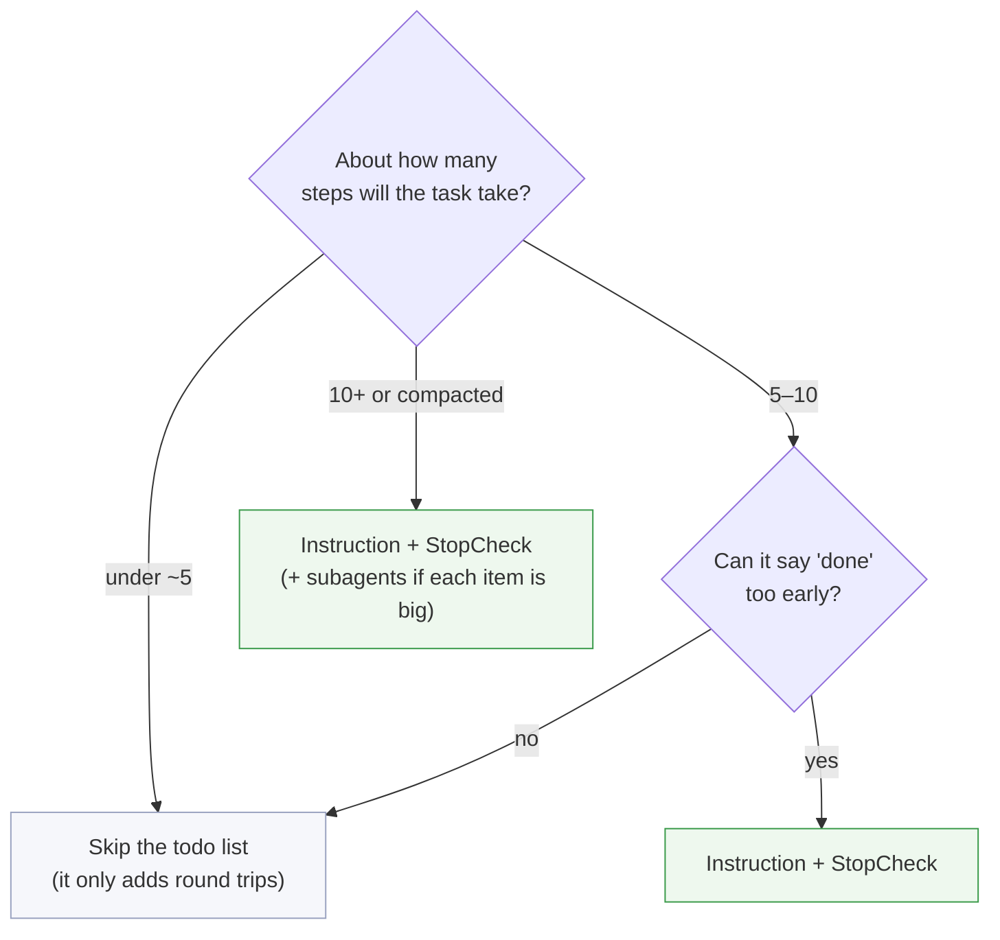

# The todo list: how an agent plans

Week 6 adds `TodoList`, a way for the model to write down a plan and keep it in view. This page covers four things:
- how it works;
- what Claude actually did with it in two real runs;
- how to make the model use it well;
- how you could extend it.

> **In one line:** the todo list is a **tool** the model *may* use to plan, plus a **hook** that shows the plan back to it on every turn. Nothing in harnessy makes the model plan. The prompt and the hooks decide whether it does.

## 1. Two jobs in one class

`TodoList` (`solutions/harnessy/todo.py`) is a tool and a hook at the same time:



**The tool** is what the model calls:

```python
todo(action="add", text="Write reports/north.md")   # → "Added #1: Write reports/north.md"
todo(action="complete", id=1)                        # → "Completed #1: Write reports/north.md"
todo(action="list")                                  # → the list
todo(action="complete", id=9)                        # → error result: "there is no item #9. Todo list: …"
```

**The hook** adds the current list to the end of the last message, every time the model is called:

```
<the last message's text>

Todo list:
[x] #1 Write reports/north.md summary
[ ] #2 Write reports/south.md summary
```

## 2. Where the list goes: the view, not the history

This is the week 4 split between the **history** (what happened) and the **view** (what the model is shown):



The order (`loop.py`, lines 99 and 100) matters for three reasons:

1. **The list survives compaction.** The context manager trims the history first, and the list is added after that. Even when early messages are summarized away, the model still sees its full current plan on every call. That's what makes the list most useful on long runs.
2. **The history stays honest.** The list is never written into `RunResult.messages`. The `todo` *tool calls* are in the history; the repeated list isn't. `test_the_todo_list_reaches_the_model_but_not_the_history` checks this.
3. **The prompt cache still works.** The list goes at the *end* of the prompt, so the beginning stays the same from one call to the next, and that beginning is what gets cached.

## 3. What the model actually does

These are two real runs on Claude Opus 5, with the solution code.

### Run A: the week 6 demo, where it didn't plan

`scripts/week6_demo.py`, part 2, gives the parent `spawn_subagent` and `todo`. The task: summarize `cats/` and `dogs/` with one helper each, then compare them.

```
step 0  spawn_subagent(cats/) + spawn_subagent(dogs/)   ← straight to work
step 1  end_turn: the comparison
```

**`todo` was never called.** The whole job was two steps, so there was nothing to plan. That's a reasonable choice.

### Run B: a four-file task, with and without an instruction

This time the task is bigger:

> data/ holds north.csv, south.csv and west.csv. For each region write a one-paragraph summary to `reports/<region>.md`, then write `reports/index.md` linking all three with the best month overall.

Both runs had `read_file`, `write_file` and `todo`. The difference: the second run's system prompt told the model to plan, and a stop check refused "done" while any item was open.



| | Without an instruction | Told to plan, with a stop check |
| --- | --- | --- |
| Calls to `todo` | **0** | 8 (4 `add`, 4 `complete`) |
| Steps | 4 | 7 |
| Tokens in / out | 7,429 / 1,934 | 19,042 / 2,953 |
| Cost (Opus 5) | about $0.09 | about $0.17 |
| Output | 4 correct files | the same 4 files |
| Stop check fired | n/a | never: every item was closed before "done" |

The plan the model wrote, as the hook showed it on the last turn:

```
Todo list:
[x] #1 Write reports/north.md summary
[x] #2 Write reports/south.md summary
[x] #3 Write reports/west.md summary
[x] #4 Write reports/index.md linking all three + best month overall
```

### What the two runs show

1. **The model plans only when asked.** With the tool available and no instruction, it skipped planning, even on a four-file job. The tool description alone wasn't enough.
2. **It looks before it plans.** It read the data *before* writing the plan, which is what a sensible person does too.
3. **It works in batches.** It added all four items in one turn and completed three in one turn, not one at a time.
4. **On a short task, planning costs more and gains nothing.** It took three extra model round trips, about 2.5× the input tokens and about twice the cost, for the same output. Each `todo` call is one more model call, and every model call resends the history.

## 4. Getting the model to plan

The levers from weakest to strongest:



### Lever 2: A planning instruction

This is the instruction used in run B:

```python
system = ("You are a careful assistant working in a small workspace folder."
          " For any task with more than two steps, first add every step to your todo list,"
          " complete each item as soon as it's done, and don't finish while items are open.")
```

### Lever 3: Open items block "done"

```python
todo = TodoList()
done_check = StopCheck(
    lambda result: None if all(done for _, _, done in todo.items)
    else "Some todo items are still open:\n" + todo.render())

agent = Agent(model,
              tools=[*file_tools(root), todo.tool()],
              hooks=[todo, done_check],
              system=system, max_steps=25)
```



`max_rejections` (2 by default) stops the hook and the model from arguing forever, and `max_steps` still applies.

### Lever 4: Plan, then delegate

Give the parent `todo` and `spawn_subagent`, but not the working tools:



The parent's context then holds only the plan and the results, which makes this the best fit for long jobs (see [`docs/subagents.md`](subagents.md)).

## 5. When to use it



The list earns its cost when the run is long enough that:
- early messages are compacted away;
- the model could lose track of what's left;
- a run could say "done" with half the work missing.

## 6. Ideas for extending it

None of these exist in harnessy yet. They make good stretch exercises:

| Idea | Why |
| --- | --- |
| An `in_progress` state | The model marks the one item it's working on, so the plan shows what's happening now. |
| `update` and `remove` actions | Plans change partway through. Today the model can only add and complete. |
| Show the list only when it changed (or every N turns) | Saves tokens on long runs. |
| Save the list to a file | A crashed or resumed run can pick up its plan again. |
| Count open items in evals | Turn "ended with open items" into a check on the transcript (week 5). |

## 7. Seeing it in a trace

`todo` calls are ordinary tool calls, so they show up in traces (see [`docs/traces.md`](traces.md)) like this (trimmed):

```json
{"kind": "model_call", "step": 1, "stop_reason": "tool_use", "tool_calls": [{"name": "todo", "arguments": {"action": "add", "text": "Write reports/north.md summary"}}, …]}
{"kind": "tool_result", "step": 1, "name": "todo", "content": "Added #1: Write reports/north.md summary", "is_error": false}
```

Here's a quick check for runs that planned but never finished their plan:

```bash
jq -r 'select(.kind=="tool_result" and .name=="todo") | .content' trace.jsonl
```

## See also

- `lessons/week6-control-flow.md`, sections 7 and 8, and exercise 6d (`tests/week6/test_todo.py`)
- `solutions/harnessy/todo.py` and `StopCheck` in `solutions/harnessy/hooks.py`
- [`docs/subagents.md`](subagents.md) and [`docs/traces.md`](traces.md)
