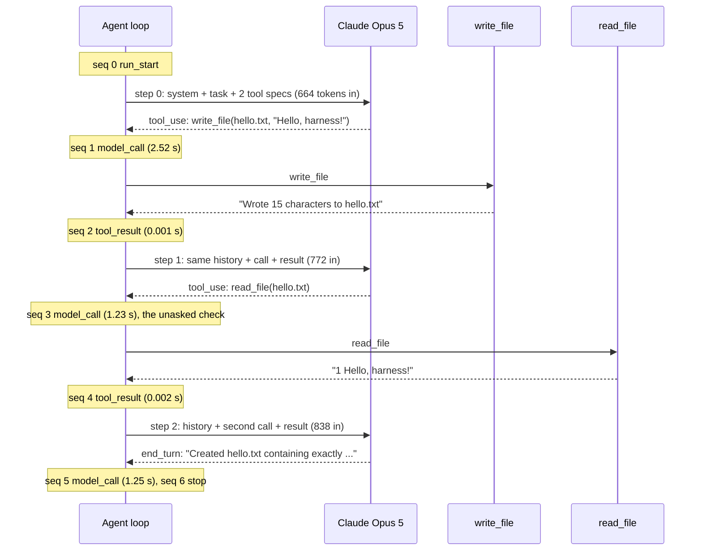

# Reading real traces

Week 5 teaches the trace format. This page reads three real traces, line by line, so you can see what an agent run actually looks like on disk and follow its logic from the first event to the last.

They come from an eval run on Claude Opus 5 (`evals/results/traces/20260928T031056Z-anthropic/`, trial 1 of tasks e01, e02 and e03). All three passed. They're short on purpose. Short traces are where you learn the shape, so long ones become readable later.

| Trace | Task | Tools | Steps | Tokens in / out | Cost | Result |
| --- | --- | --- | --- | --- | --- | --- |
| [e03](#1-e03-no-tools-one-step) | 37 × 43 | none | 1 | 67 / 20 | $0.0008 | passed |
| [e02](#2-e02-one-tool-call-then-the-answer) | Count the lines in `poem.txt` | `read_file`, `write_file` | 2 | 1,498 / 67 | $0.0092 | passed |
| [e01](#3-e01-write-then-check-unasked) | Write `hello.txt` | `read_file`, `write_file` | 3 | 2,274 / 170 | $0.0156 | passed |

Cost is at Opus 5's $5 per million input tokens and $25 per million output tokens (the price table arrives with week 7's `cost.py`).

They're in order of size: no tools, then one tool call, then two.

## How to read a trace

A trace is a `.jsonl` file: one JSON object per line, one line per event, written as it happens. Every line has:

- `run_id`: the same for every line of one run;
- `seq`: 0, 1, 2, … in the order the events were written;
- `t`: seconds since the run started;
- `kind`: what happened.

There are four kinds, and every run has the same skeleton:

```
run_start                       what the agent was given
  model_call   (step 0)         what the model said, and the tools it asked for
  tool_result  (step 0)         one line per tool call, what the tool returned
  model_call   (step 1)
  ...
stop                            why it ended, and the totals
```

A `model_call` and the `tool_result` lines after it share a `step` number. Each tool call is linked to its result by id: `tool_calls[].id` in the `model_call` and `tool_call_id` in the `tool_result`.

There are no timers in the loop. **How long something took is the gap between two `t` values.** The gap before a `model_call` is the model's time; the gap before a `tool_result` is the tool's.

To print any trace as a timeline:

```bash
uv run python -m scripts.trace_view evals/results/traces/<run>/<task>-1.jsonl
```

## 1. e03: no tools, one step

**The task file** (`evals/tasks/e03-arithmetic.yaml`) gives the agent no toolsets and at most 2 steps:

```yaml
prompt: "What is 37 multiplied by 43? Answer with just the number."
checks:
  - type: answer_matches
    pattern: "\\b1,?591\\b"
```

**The trace:**

```json
{"run_id": "6f47bc52", "seq": 0, "t": 0.0, "kind": "run_start", "task": "What is 37 multiplied by 43? Answer with just the number.", "model": "claude-opus-5", "system": "You are a careful assistant working in a small workspace folder. Use the tools when they help. Finish with a short, direct answer.", "tools": []}
{"run_id": "6f47bc52", "seq": 1, "t": 2.417, "kind": "model_call", "step": 0, "stop_reason": "end_turn", "input_tokens": 67, "output_tokens": 20, "text": "1591", "tool_calls": []}
{"run_id": "6f47bc52", "seq": 2, "t": 2.417, "kind": "stop", "stop_reason": "end_turn", "steps": 1, "input_tokens": 67, "output_tokens": 20, "error": null, "final_text": "1591"}
```

**The flow:**

1. **`run_start`** records what the agent was given: the task, the model, the system prompt and the tool names. Here `tools` is `[]`.
2. **`model_call`, step 0.** The loop sends the system prompt and the task. The model answers `1591` with `stop_reason: "end_turn"`, meaning it's done, and asks for no tools. That took 2.4 seconds.
3. **`stop`.** There are no tool calls to run, so the loop ends. `final_text` is the answer the grader checks, and it matches `\b1,?591\b`, so the task passes.

This is the smallest possible run: one model call and no loop at all. Two things to notice:

- **Most of the input is the system prompt.** The whole request, system prompt plus task, is only 67 input tokens. Keep that number in mind for the next trace.
- **20 output tokens for a 4-character answer.** Opus 5 thinks by default, and thinking is billed as output.

## 2. e02: one tool call, then the answer

**The task file** gives the agent the `files` toolset and puts a 7-line `poem.txt` in its workspace:

```yaml
toolsets: [files]
max_steps: 4
prompt: "How many lines does poem.txt have? Answer with just the number."
files:
  poem.txt: |
    The loop begins with a single call,
    ...
checks:
  - type: answer_matches
    pattern: "\\b7\\b"
```

**The trace:**

```json
{"run_id": "ea45f5a3", "seq": 0, "t": 0.0, "kind": "run_start", "task": "How many lines does poem.txt have? Answer with just the number.", "model": "claude-opus-5", "system": "You are a careful assistant working in a small workspace folder. Use the tools when they help. Finish with a short, direct answer.", "tools": ["read_file", "write_file"]}
{"run_id": "ea45f5a3", "seq": 1, "t": 1.692, "kind": "model_call", "step": 0, "stop_reason": "tool_use", "input_tokens": 659, "output_tokens": 64, "text": "I'll read the file to count its lines.", "tool_calls": [{"id": "toolu_01HGAi1cDNj1jAfGLuct5T92", "name": "read_file", "arguments": {"path": "poem.txt"}}]}
{"run_id": "ea45f5a3", "seq": 2, "t": 1.696, "kind": "tool_result", "step": 0, "name": "read_file", "arguments": {"path": "poem.txt"}, "tool_call_id": "toolu_01HGAi1cDNj1jAfGLuct5T92", "content": "    1\tThe loop begins with a single call,\n    2\ta model that answers, or none at all.\n    3\tIt asks for a tool, we run it, and then\n    4\twe hand back the result and ask it again.\n    5\tIt stops when it's done, or a limit is hit,\n    6\tand every step's written down, bit by bit.\n    7\tThat's all there is to it.", "is_error": false}
{"run_id": "ea45f5a3", "seq": 3, "t": 2.614, "kind": "model_call", "step": 1, "stop_reason": "end_turn", "input_tokens": 839, "output_tokens": 3, "text": "7", "tool_calls": []}
{"run_id": "ea45f5a3", "seq": 4, "t": 2.615, "kind": "stop", "stop_reason": "end_turn", "steps": 2, "input_tokens": 1498, "output_tokens": 67, "error": null, "final_text": "7"}
```

**The flow:**

1. **`run_start`.** This time the agent has two tools, `read_file` and `write_file`.
2. **`model_call`, step 0 (1.69 s).** The model can't see the workspace, so it says what it will do and asks for `read_file` on `poem.txt`. Its stop reason is `tool_use`, which tells the loop it isn't finished: run the tool and call it again.
3. **`tool_result`, step 0 (0.004 s).** The loop runs `read_file`. The `tool_call_id` matches the `id` in the call above, so the result answers that call. Two things about the content:
   - **The lines come back numbered** (`    1\t…` to `    7\t…`), because harnessy's `read_file` numbers them. That makes counting trivial. A tool's output format is part of how well the agent does.
   - **`is_error` is false.** A failure would be a result with `is_error: true`, not a crash.
4. **`model_call`, step 1 (0.92 s).** The loop sends the whole conversation again: the task, the model's own tool call, and the result. The model answers `7` and stops with `end_turn`.
5. **`stop`.** It took 2 steps, and the totals add up the two calls: 659 + 839 = 1,498 input tokens. The answer matches `\b7\b`, so the task passes.

**What's worth noticing:**

- **The tools cost about 600 tokens on every call.** The first call here is 659 input tokens against e03's 67. The prompts are similar; the difference is the tool definitions, sent on every request.
- **Input grows each step.** It's 659, then 839, because the history is sent again every time (the API is stateless). The 180 extra tokens are mostly the poem.
- **The model is the slow part.** About 2.6 s were model calls; the tool took 4 milliseconds.

## 3. e01: write, then check unasked

**The task file** gives the `files` toolset and grades the workspace, not the answer:

```yaml
toolsets: [files]
max_steps: 4
prompt: "Create a file named hello.txt containing exactly this text: Hello, harness!"
checks:
  - type: file_contains
    path: hello.txt
    text: "Hello, harness!"
```

**The trace:**

```json
{"run_id": "77eb2859", "seq": 0, "t": 0.0, "kind": "run_start", "task": "Create a file named hello.txt containing exactly this text: Hello, harness!", "model": "claude-opus-5", "system": "You are a careful assistant working in a small workspace folder. Use the tools when they help. Finish with a short, direct answer.", "tools": ["read_file", "write_file"]}
{"run_id": "77eb2859", "seq": 1, "t": 2.518, "kind": "model_call", "step": 0, "stop_reason": "tool_use", "input_tokens": 664, "output_tokens": 88, "text": "I'll create that file for you.", "tool_calls": [{"id": "toolu_01NWVEVT74ns5HAt4dNZ9nVv", "name": "write_file", "arguments": {"path": "hello.txt", "content": "Hello, harness!"}}]}
{"run_id": "77eb2859", "seq": 2, "t": 2.519, "kind": "tool_result", "step": 0, "name": "write_file", "arguments": {"path": "hello.txt", "content": "Hello, harness!"}, "tool_call_id": "toolu_01NWVEVT74ns5HAt4dNZ9nVv", "content": "Wrote 15 characters to hello.txt", "is_error": false}
{"run_id": "77eb2859", "seq": 3, "t": 3.749, "kind": "model_call", "step": 1, "stop_reason": "tool_use", "input_tokens": 772, "output_tokens": 51, "text": "", "tool_calls": [{"id": "toolu_01AVSVsiruFKSXzThEMmYsb5", "name": "read_file", "arguments": {"path": "hello.txt"}}]}
{"run_id": "77eb2859", "seq": 4, "t": 3.751, "kind": "tool_result", "step": 1, "name": "read_file", "arguments": {"path": "hello.txt"}, "tool_call_id": "toolu_01AVSVsiruFKSXzThEMmYsb5", "content": "    1\tHello, harness!", "is_error": false}
{"run_id": "77eb2859", "seq": 5, "t": 5.005, "kind": "model_call", "step": 2, "stop_reason": "end_turn", "input_tokens": 838, "output_tokens": 31, "text": "Created `hello.txt` containing exactly `Hello, harness!` (15 characters).", "tool_calls": []}
{"run_id": "77eb2859", "seq": 6, "t": 5.005, "kind": "stop", "stop_reason": "end_turn", "steps": 3, "input_tokens": 2274, "output_tokens": 170, "error": null, "final_text": "Created `hello.txt` containing exactly `Hello, harness!` (15 characters)."}
```

**The same run as a sequence:**



**The flow:**

1. **`run_start`.** The same two tools as e02.
2. **`model_call`, step 0 (2.52 s).** The model asks for `write_file` with exactly the text from the task.
3. **`tool_result`, step 0.** The file is written, and the result says `Wrote 15 characters`.
4. **`model_call`, step 1 (1.23 s).** The job is already done, but the model doesn't trust it yet. Its `text` is empty and it asks for `read_file` on the same file, to check its own work. Nothing in the task asked for this.
5. **`tool_result`, step 1.** The file contains `Hello, harness!`.
6. **`model_call`, step 2 (1.25 s).** Now the model is satisfied: `end_turn`, with a one-line summary.
7. **`stop`.** The run used 3 of its 4 steps, and 664 + 772 + 838 = 2,274 input tokens.
8. **The grade.** `file_contains` opens `hello.txt` in the trial's workspace. The check passes because of the file, whatever the final text says.

**What's worth noticing:**

- **Checking its own work.** The verification step cost about 1.2 s, about 820 input tokens, and roughly a third of the run's $0.016. It's what a careful person would do, and on harder tasks it catches real mistakes. Here it couldn't change the outcome. Only the trace shows this behavior; the pass/fail result alone never would.
- **The grader checks the outcome, not the transcript.** The grade comes from what's in the workspace. A model that wrote the file and then claimed it had failed would still pass; a model that claimed success without writing would fail. Week 5 calls these the *outcome* and the *transcript*, and you need both.
- **The step limit has little slack.** With `max_steps: 4`, the check step leaves only one step to spare. If the model had checked twice, the run would end with `stop_reason: "max_steps"`. The file would still be there, so this task would still pass, but a task graded on the answer would fail. Shrink `max_steps` (as `scripts/week5_demo.py` does with `max_steps=1`) and you can watch that happen.

## 4. What the three together show

| | e03 | e02 | e01 |
| --- | --- | --- | --- |
| Model time | 2.42 s | 2.61 s | 5.00 s |
| Tool time | – | 0.004 s | 0.003 s |
| First call's input | 67 | 659 | 664 |
| Input per step | 67 | 659 → 839 | 664 → 772 → 838 |

1. **The loop is the same every time.** Call the model. If it asked for tools, run them, add the results and call it again. Otherwise stop. The traces differ only in how many times that goes around.
2. **The stop reason drives the loop.** `tool_use` means "go round again", and `end_turn` means "done". A trace that ends with `max_steps`, `max_tokens`, `timeout`, `refused`, `blocked` or `model_error` tells you *why* a run failed before you read anything else.
3. **Cost and latency are almost all model.** The tools took milliseconds. To make an agent faster or cheaper, look at the number of steps and the size of the context, not the tools.
4. **The context only grows.** Every step resends everything before it, so a run's total input grows roughly with the square of its length. This is what week 4's `ContextManager` is for.
5. **A pass rate hides behavior.** All three passed, but e01 spent a third of its cost on a check it didn't need. You see that only in the trace. That's why week 5 asks you to read failed and passed traces, not just the results table.

## Try it yourself

```bash
# re-run the easy tasks (e01-e03 among them) on Claude, then print a new trace
uv run python -m scripts.evals --provider anthropic --tasks easy --trials 1
uv run python -m scripts.trace_view evals/results/traces/<new run>/e01-write-greeting-1.jsonl

# or with jq: every tool the model called, and how long each model call took
jq -c 'select(.kind=="model_call") | {step, t, tools: [.tool_calls[].name]}' evals/results/traces/<run>/e01-write-greeting-1.jsonl
```

Run e01 a few times and compare. Does the model always check its own work? On OpenAI (`--provider openai`), does it check at all?
