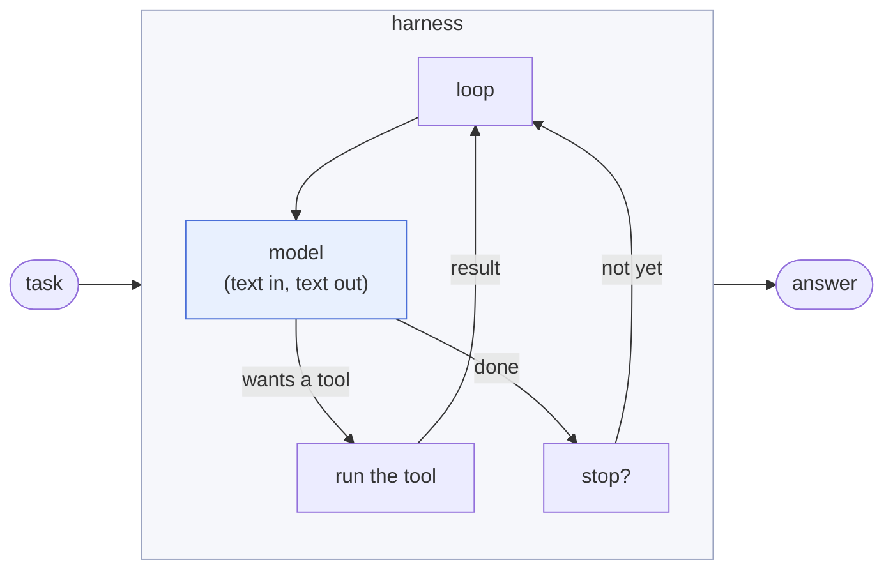
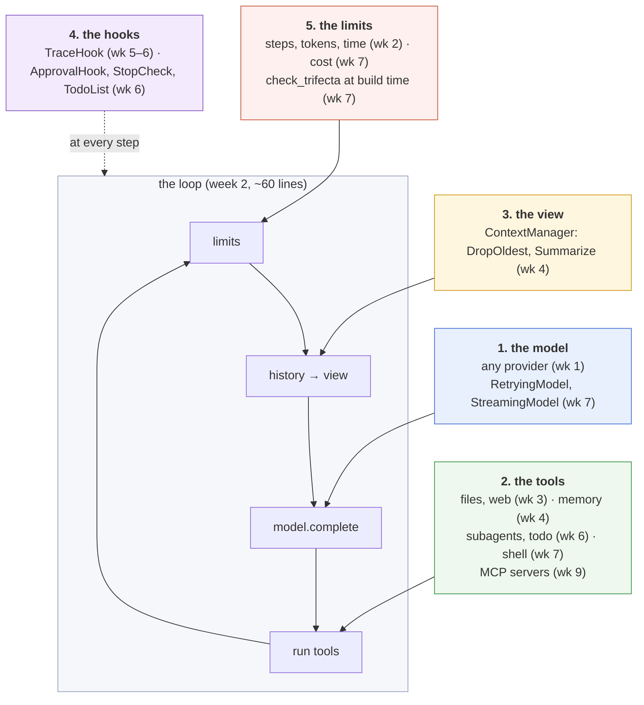

# What is a harness?

Read this first, before week 1. It shows the whole harness you are about to build on one screen, with each line marked by the week that adds it. The weeks then fill in one piece at a time.

> **In one line:** the model turns text into text. The harness is the program around it that turns that into an *agent*: it keeps calling the model, runs the tools it asks for, decides what it sees, and decides when to stop.

## 1. A model alone can't do anything

Give a model the task "how many lines are in `notes.txt`?" and it can only answer with text. It can't open the file. At best it replies with something like:

```json
{"tool": "read_file", "arguments": {"path": "notes.txt"}}
```

That is a *request*, not an action. Something has to notice it, actually read the file, send the contents back, and call the model again so it can count. That something is the harness.



Everything else in this course answers one question about that loop:

| Question | Who answers it | Week |
| --- | --- | --- |
| How do I talk to any model the same way? | the model interface | 1 |
| When do I call the model again, and when do I stop? | the loop and its limits | 2 |
| What can the model do, and what if it asks wrong? | tools | 3 |
| What does the model see when the history gets long? What does it remember next time? | context and memory | 4 |
| What happened in a run, and is it getting better? | traces and evals | 5 |
| Who may watch, change or refuse a step? | hooks, approvals, subagents, the todo list | 6 |
| What if the network fails, the bill runs up, or a web page lies? | retries, streaming, cost, sandbox, the trifecta check | 7 |
| Is any of this specific to one agent? | the capstone: three agents, one harness | 8 |

## 2. The whole harness on one screen

This is `Agent` from `solutions/harnessy/loop.py` as it is after week 7. Only the logging, the `stream` method and four small fields (`clock`, `verbose`, `printer`, `prices`) are left out, and `finish` is shown without its type hints. The comment on each line says which week adds it. **Week 2 writes the loop; every later week adds only a few lines to it.**

```python
@dataclass
class Agent:
    model: Model                                                    # week 2
    tools: list[Tool] | tuple[Tool, ...] = ()                       # week 2
    system: str | None = None                                       # week 2
    max_steps: int = 10                                             # week 2
    max_tokens_total: int = 100_000                                 # week 2
    timeout_s: float = 120.0                                        # week 2
    context: ContextManager | None = None                           # week 4
    tracer: Tracer | None = None                                    # week 5
    hooks: list[Hook] | tuple[Hook, ...] = ()                       # week 6
    max_cost_usd: float | None = None                               # week 7

    def __post_init__(self) -> None:
        self._registry = ToolRegistry(self.tools)                   # week 3
        self._hooks = HookRunner([*self.hooks, *([TraceHook(self.tracer)] if self.tracer else [])])  # week 6
        self._price = price_for(self.model.name, self.prices)       # week 7
        check_trifecta(self.tools, self.hooks)                      # week 7: refuse to build a leaky agent

    def run(self, task: str) -> RunResult:
        messages = [Message(role="user", text=task)]                # week 2: the history
        steps, usage = [], Usage()                                  # week 2
        specs = self._registry.specs()                              # week 3: what the model may call
        start = self.clock()                                        # week 2

        def finish(reason, text="", error=None):                    # week 2: every exit goes through here
            result = RunResult(text, reason, steps, usage, messages, error, cost())  # cost(): week 7
            self._hooks.on_finish(result)                           # week 6
            return result

        self._hooks.on_start(self, task)                            # week 6

        while True:                                                 # week 2: the loop
            if len(steps) >= self.max_steps:                        # week 2: limits
                return finish("max_steps")
            if usage.total >= self.max_tokens_total:                # week 2
                return finish("max_tokens")
            if self.clock() - start >= self.timeout_s:              # week 2
                return finish("timeout")
            if self.max_cost_usd is not None and cost() >= self.max_cost_usd:  # week 7
                return finish("max_cost")

            try:
                view = self.context.prepare(messages) if self.context else messages  # week 4: history -> view
                view = self._hooks.before_model(view)               # week 6
                if isinstance(view, Block):                         # week 6
                    return finish("blocked", error=view.reason)
                response = self._hooks.after_model(                 # week 6
                    self.model.complete(view, specs, self.system))  # week 1 interface, week 2 call
            except Exception as e:                                  # week 2: never crash
                return finish("model_error", error=f"{type(e).__name__}: {e}")

            usage = usage + response.usage                          # week 2
            messages.append(response.message)                       # week 2

            if response.message.tool_calls and response.stop_reason not in ("max_tokens", "error", "refused"):
                results = tuple(self._run_tool(c) for c in response.message.tool_calls)  # week 2
                messages.append(Message(role="user", tool_results=results))              # week 2
                steps.append(Step(len(steps), response, results))
                continue                                            # week 2: go round again

            steps.append(Step(len(steps), response))
            text = response.message.text
            if response.stop_reason == "refused":                   # week 2
                return finish("refused", text)
            if response.stop_reason in ("error", "max_tokens"):     # week 2
                return finish("model_error", text, error=f"model stopped with '{response.stop_reason}'")
            rejection = self._hooks.on_stop(RunResult(text, "end_turn", steps, usage, messages, cost_usd=cost()))  # week 6
            if rejection:                                           # week 6: "not done yet"
                messages.append(Message(role="user", text=rejection))
                continue
            return finish("end_turn", text)                         # week 2

    def _run_tool(self, call: ToolCall) -> ToolResult:
        checked = self._hooks.before_tool(call)                     # week 6: may refuse
        if isinstance(checked, Block):
            return self._hooks.after_tool(call, ToolResult(call.id, checked.reason, is_error=True))
        return self._hooks.after_tool(checked, self._registry.call(checked))  # week 3: validate, run, truncate
```

The full file is 158 lines. Week 5 also adds tracing straight into this loop, and week 6 takes it out again by turning it into `TraceHook`. That swap is the reason hooks exist, and lesson 6 walks through it.

## 3. Five places to plug in

The loop stays small because almost everything plugs in from outside, at one of five places. Learn these and you can read any harness, including Claude Code.



| Place | What plugs in | Why it's outside the loop |
| --- | --- | --- |
| **The model** | an adapter per provider; wrappers that retry or stream | the loop never knows which provider answered, or that it took three tries |
| **The tools** | any function with `@tool`; a subagent and an MCP server are just tools too | the model decides *when*; the loop only runs what it asks for |
| **The view** | a context strategy | the history stays complete; only what the model *sees* gets shorter |
| **The hooks** | code that watches, changes or blocks a step | rules that must hold *every time*, whatever the model wants |
| **The limits** | step, token, time and cost caps; the trifecta check | a run must always end, and some agents must never be built |

Two rules follow, and the rest of the course keeps coming back to them:

- **The model decides what to do; the harness decides what is allowed.** Something the model chooses (read a file, plan, delegate) is a tool. Something that must happen every time (ask before sending email, refuse to stop while tests fail) is a hook or a limit. Never put a must-happen rule only in the prompt.
- **An agent is just configuration.** By week 8, a research agent, a code agent and a data agent are each a system prompt, a list of tools and some limits on the *same* `Agent`. If agent-specific logic creeps into the loop, the harness isn't generic anymore.

## 4. Why the harness matters as much as the model

Two products on the same model can behave very differently. They differ in what the model sees (context), what it can do (tools), what it is stopped from doing (hooks and limits), and whether anyone checks the result (evals). Each line in section 2 is a decision like that. The course has you make each one yourself, and week 5's evals let you measure whether it helped.

## 5. See it for real

- Run the week 2 demo and watch the loop go round; it prints every step: `uv run python -m scripts.week2_demo`.
- Read a real run line by line in [`docs/traces.md`](traces.md).
- See the same five plug-in points in a product you use every day: [`docs/claude-code.md`](claude-code.md).

## See also

- [`LEARNING_PLAN.md`](../LEARNING_PLAN.md): the 8-week plan
- [`docs/architecture.md`](architecture.md): every part with class, sequence and state diagrams
- [`docs/anatomy.html`](anatomy.html): the same layers as organs of a body
- [`docs/hooks.md`](hooks.md), [`docs/subagents.md`](subagents.md), [`docs/todo.md`](todo.md), [`docs/trifecta.md`](trifecta.md)
