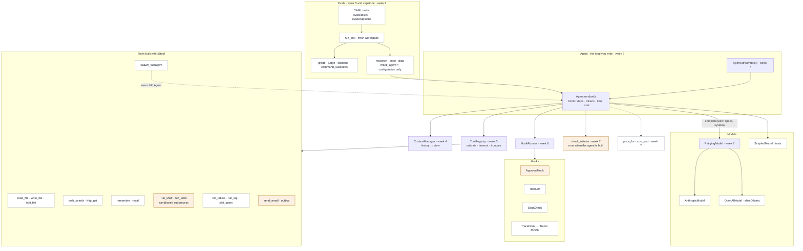
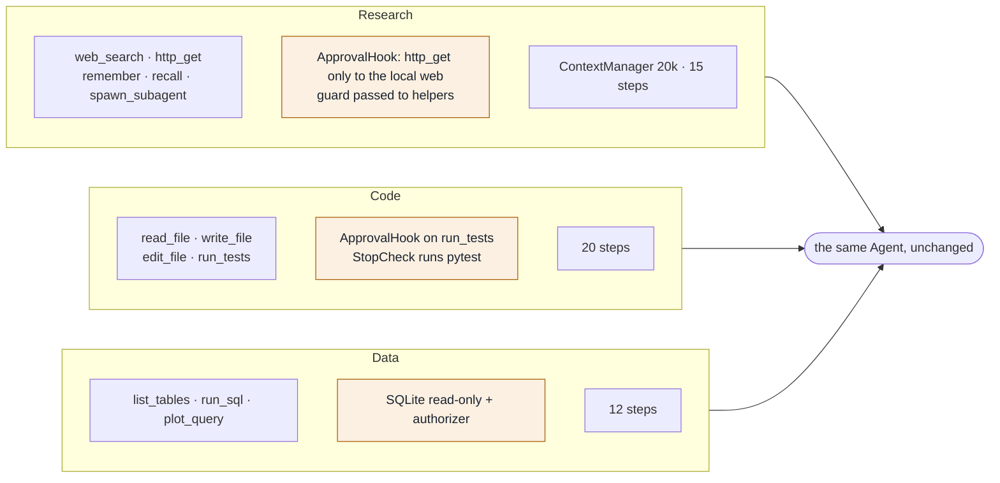
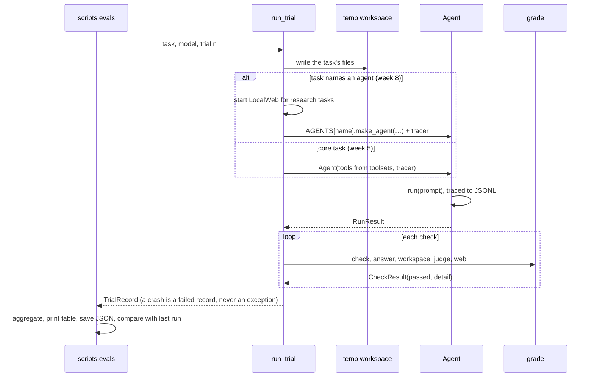

# Week 8: Capstone — prove it's generic

**Time:** about 5 hours (1 building, 1.5 running and reading traces, 1.5 comparing, 1 writing up).

**Before you start:** weeks 2–7 must pass, including all the wiring (`uv run pytest tests/week2 tests/week3 tests/week4 tests/week5 tests/week6 tests/week7`).

**You're done when:**

1. `uv run pytest tests/week8` passes (32 tests), and
2. `uv run python -m scripts.evals --suite capstone --provider both --trials 3` shows each agent passing at least 3 of its 5 tasks on each provider, and
3. the write-up in `NOTES.md` (section 10) is finished.

## 1. What "generic" means

A harness is generic if very different agents run on it **without changes to the harness**. This week you build three:

- a researcher;
- a programmer;
- a data analyst.

Each is *configuration only*: a system prompt, tools, hooks and limits, passed to the same `Agent`. Look at `harnessy/agents/*.py`. Each `make_agent` is a few lines. Whatever you had to change in `harnessy` to make one of them work is what you learned, so write it down.

Everything you've built, in one picture:



*Fig 1 in [docs/architecture.md](../docs/architecture.md#fig-1-system-architecture).*

## 2. The three agents

| | Research | Code | Data |
| --- | --- | --- | --- |
| Tools | `web_search`, `http_get`, `remember`, `recall`, `spawn_subagent` | `read_file`, `write_file`, `edit_file`, `run_tests` | `list_tables`, `run_sql`, `plot_query` |
| Hooks | an `ApprovalHook` (it's the lethal trifecta) | an `ApprovalHook` on `run_tests`, and a `StopCheck` that runs the tests | none |
| Limits | 15 steps, `ContextManager(20,000)` | 20 steps | 12 steps |
| Tasks check | the answer is right **and** every cited page exists and supports it | the repo's tests pass **and** a hidden check runs the code directly | the number or name matches a known answer |

The 15 tasks live in `evals/capstone/{research,code,data}/`. Each YAML names its agent (`agent: research`), and the runner builds that agent for the trial.

The three configurations on the same `Agent`:



*Fig 14 in [docs/architecture.md](../docs/architecture.md#fig-14-the-three-capstone-agents-on-one-harness).*

## 3. The local web

A real search API would need another key, cost money, and return different results every day, so your evals couldn't be repeated. Instead, `evals/corpus/` holds 16 short pages about the **Orwen region**, a place that doesn't exist. Because the facts are made up, the model can't answer from memory: it has to search, read and cite.

- **`LocalWeb(folder)`** serves the pages on `127.0.0.1:<random port>` for the length of a trial.
- **`search(query)`** (your exercise) ranks pages by shared words, with title matches counting double.
- **`http_get`**, from week 3, fetches a page as usual.
- **The `citations` check** (your exercise, `check_citations`) is the strict part. It pulls every URL out of the answer and requires three things:
  - every URL is a real page on the local web;
  - there is at least one;
  - every expected fact appears on at least one cited page.

  An answer that's right but cites nothing fails. So does one citing a page that doesn't say it.

## 4. The research agent is the lethal trifecta

The research agent's tools cover all three legs:

- **Private data:** `recall` (memory).
- **Untrusted input:** `web_search` and `http_get` (web pages).
- **A way out:** `http_get` again (a URL can carry data away) and `spawn_subagent`, which inherits `http_get`'s tags.

So `check_trifecta` from week 7 refuses to build it unless those tools are guarded. The config uses:

```python
guard = ApprovalHook({"http_get": "ask", "spawn_subagent": "ask"}, approver=research_approver(web))
```

`research_approver` (given) approves `http_get` **only to the local web's host**, and always approves `spawn_subagent`. The helper is safe to approve because it gets the same guard: `subagent_tool(model, readers, hooks=[guard])`. A helper without it would be exactly the bypass found in the weeks 5–6 review.

In a real deployment, the same config with a real search tool would need a real policy: an allow-list of domains, or a person saying yes.

## 5. The code agent

- **`edit_file(path, old, new)`** replaces text that must appear **exactly once** (your exercise, `edit_text`). An edit that could match two places is refused with "include more context", so the model can't change the wrong line without noticing.
- **`run_tests`** runs pytest through week 7's sandbox: a subprocess, a scrubbed environment and a real timeout. It's tagged with all three trifecta legs, like `run_shell`, because running tests runs code the model may just have written. So the code agent needs a guard too: `ApprovalHook({"run_tests": "ask"}, approver=trust_workspace_tests)`. That approver says yes on purpose, and its docstring says why: the eval repo is a throwaway, and the run is sandboxed. In production you'd run tests in a container with no network, or ask a person.
- **A `StopCheck` runs the tests** whenever the model says it's done, and sends it back with the failures if they don't pass. That's week 6's stretch, now doing real work. The agent literally can't finish with red tests. `test_code_agent_is_sent_back_while_the_tests_fail` shows it.
- **The task checks don't trust the tests.** A model can make pytest pass without fixing anything: `pytestmark = pytest.mark.skip` at the top of the test file, or a `conftest.py` that skips everything. So each code task also has a **hidden** check: `python -c "from stats import mean; assert mean([2, 4, 6]) == 4 ..."` runs the code directly, and the agent never sees it. The final review found the skip trick, and we checked that each hidden check fails the cheat and passes the real fix.

## 6. The data agent

- `make_agent` builds `data.db` from the task's `data.sql`.
- **Read-only is enforced by SQLite, not by you.** Checking the SQL text for `DELETE` is a losing game: there are too many ways to write a write. `connect_readonly` (given) uses two layers:
  - It opens the file with `mode=ro`.
  - It adds an *authorizer* that allows only reading actions.

  The second layer matters. `mode=ro` alone still lets `ATTACH DATABASE '/any/path'` create a new file and `VACUUM INTO '/any/path'` copy the whole database anywhere on disk. The final review of this week found exactly that. With the authorizer, those statements, `PRAGMA`s and temp tables all fail with `not authorized`. `query_readonly` (your exercise) runs one statement and formats the rows. Two statements in one call fail on their own, because `execute` runs only one.
- `plot_query(sql, out)` draws an SVG bar chart from a two-column query. It replaces the learning plan's `plot_csv`: this agent can't write files, so it would have no CSV to plot.

## 7. Exercises

| # | Function | File | Tests |
| --- | --- | --- | --- |
| 8a | `LocalWeb.search` | `tools/localweb.py` | `uv run pytest tests/week8/test_localweb.py` |
| 8b | `edit_text` | `tools/code.py` | `uv run pytest tests/week8/test_code.py` |
| 8c | `query_readonly` | `tools/data.py` | `uv run pytest tests/week8/test_data.py` |
| 8d | `check_citations`, plus the `citations` and `command_succeeds` branches in `grade`, and the `agent` field in `load_task` | `evals/graders.py`, `evals/tasks.py` | `uv run pytest tests/week8/test_capstone_checks.py tests/week5` |
| 8e | the three `make_agent`s | `agents/research.py`, `code.py`, `data.py` | `uv run pytest tests/week8/test_agents.py` |

For 8d you're adding to week 5 code you already wrote. The docstrings say exactly what's new.

## 8. Run the capstone

**This costs money.** It's 15 tasks per provider, and the research tasks take several steps each. Start with one trial:

```bash
uv run python -m scripts.evals --suite capstone --trials 1 --provider anthropic
uv run python -m scripts.evals --suite capstone --tasks c0 --trials 3      # one agent, both providers
uv run python -m scripts.evals --suite capstone --provider both --trials 3 # the "done when"
```

When we built this, both Claude Opus 5 and GPT-5.5 passed all 15 tasks in one trial (about $0.04 and $0.02 per task). A suite everyone passes can't tell two versions apart, so it has saturated. Once yours passes, make it harder: add a distractor page that contradicts the real one, a bug that spans two files, or a question that needs a join across three tables. Then see which harness changes the harder tasks call for.

Results are saved as `evals/results/<time>-capstone-<provider>.json`, so they're compared with your previous capstone runs, not with week 5's. Read every failure with `scripts.trace_view` before you change anything:

- Did the researcher cite a page it never fetched?
- Did the programmer edit the tests?
- Did the analyst answer before querying?

One capstone trial. Agent tasks are built by their `make_agent`, and research trials get a local web:



*Fig 13 in [docs/architecture.md](../docs/architecture.md#fig-13-one-eval-trial).*

## 9. Compare

Spend about an hour on each. For every part of your architecture, write down how the other harness handles it.

| Read | Notice |
| --- | --- |
| [mini-swe-agent](https://github.com/SWE-agent/mini-swe-agent/) | the minimal end: one loop, one tool (bash), no tool schemas at all |
| [LangGraph](https://github.com/langchain-ai/langgraph) | the loop as an explicit state graph, and what that buys for branching and resuming |
| [OpenAI Agents SDK](https://github.com/openai/openai-agents-python) | handoffs, guardrails and tracing as built-in features |

| Part of harnessy | mini-swe-agent | LangGraph | OpenAI Agents SDK |
| --- | --- | --- | --- |
| Model interface (week 1) | | | |
| Loop and limits (week 2) | | | |
| Tools and errors (week 3) | | | |
| Context (week 4) | | | |
| Traces and evals (week 5) | | | |
| Hooks, approvals, subagents (week 6) | | | |
| Retries, cost, sandbox, safety (week 7) | | | |

## 10. Write-up for `NOTES.md` (about one page)

```markdown
## Capstone

### Pass rates (3 trials each)
| Agent    | Anthropic | OpenAI |
| -------- | --------- | ------ |
| Research |   /5      |   /5   |
| Code     |   /5      |   /5   |
| Data     |   /5      |   /5   |

### What each agent forced me to change in the harness
- Research:
- Code:
- Data:

### What was truly reusable, unchanged

### What I'd do differently if I started again

### One failure I read in a trace, and what it taught me
```

**Stretch.** Read OpenAI's [Harness engineering](https://openai.com/index/harness-engineering/) post about building a product almost entirely with agents. Then map its ideas onto your design. The three to look for are making things legible to the agent, enforcing rules mechanically, and fast feedback loops. Which ones does harnessy already do, and which would you add next?

## 11. Check yourself

- `HARNESSY_IMPL=solutions uv run pytest tests/week8`
- `HARNESSY_IMPL=solutions uv run python -m scripts.evals --suite capstone --trials 1`
- `diff -r harnessy/agents solutions/harnessy/agents`

That's the course. You built a model interface, a loop, tools, context management, traces, evals, hooks, approvals, subagents, retries, streaming, cost limits, a sandbox and a safety check. Then you proved it's generic by running three very different agents on it unchanged.
