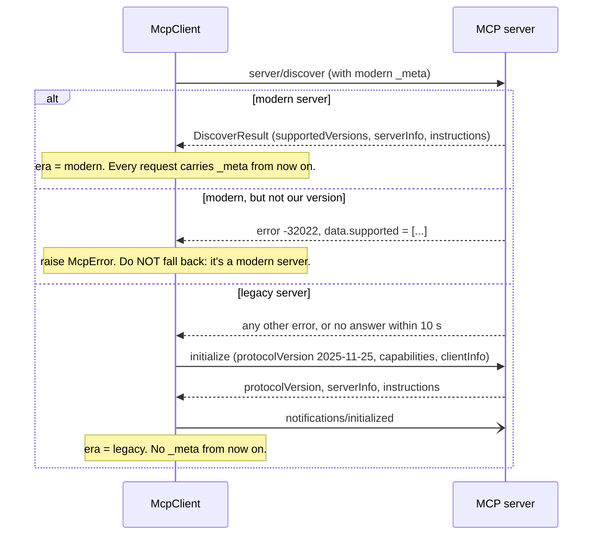
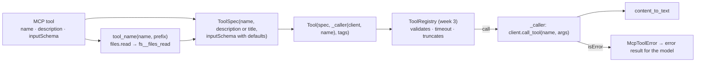

# Week 9 (bonus): Tools from anywhere with MCP

**Time:** about 5 hours (1 reading, 3 building, 1 trying real servers and taking notes).

**Before you start:** weeks 2–7 must pass, including their wiring. Week 9 needs no loop changes at all, but it relies on the week 3 registry, the week 6 approval hook and the week 7 trifecta check.

**You're done when:**

1. `uv run pytest tests/week9` passes (23 tests), and
2. `uv run python -m scripts.week9_demo` connects to the bundled notes server, saves three notes through MCP, and finds one by searching.

## 1. Read first

| Read | Look for |
| --- | --- |
| [MCP specification overview](https://modelcontextprotocol.io/specification/2026-07-28) | Hosts, clients and servers; tools vs resources vs prompts; the security principles at the end. |
| [Versioning and compatibility](https://modelcontextprotocol.io/specification/2026-07-28/basic/versioning) | "Modern" vs "legacy" servers, and the compatibility matrix. |
| [The stdio transport](https://modelcontextprotocol.io/specification/2026-07-28/basic/transports/stdio) | One JSON message per line; the backward-compatibility probe; shutdown. |
| [Tools](https://modelcontextprotocol.io/specification/2026-07-28/server/tools) | `tools/list`, `tools/call`, content types, and protocol errors vs tool errors. |

## 2. Why MCP

In week 3 you learned that a model only knows a tool through its name, its description and a JSON Schema. The Model Context Protocol (MCP) is an agreement about exactly that. A **server** publishes tools in that shape, and any **client** can list and call them. Someone writes a GitHub server, a database server or a browser server once, and every agent that speaks MCP can use it.

MCP doesn't replace function calling. The model still asks for tools with `tool_use`, and MCP only changes where the tool comes from and where it runs. [`docs/function-calling-vs-mcp.md`](../docs/function-calling-vs-mcp.md) builds one tool both ways and shows what each side sends.

Your harness already speaks "name + description + JSON Schema". This week you teach it the protocol around that, so any MCP server's tools become ordinary harnessy `Tool`s. The loop, the registry, approvals, tracing and evals all work on them unchanged.

## 3. The protocol in one screen

- **JSON-RPC 2.0.** A request has an `id`, a `method` and `params`. A response has the same `id` and either a `result` or an `error` (`code`, `message`, `data`). A notification has no `id` and gets no answer.
- **stdio.** The client starts the server as a subprocess. Each message is one line of JSON on the server's stdin or stdout, with no newlines inside a message. The server's stderr is for its logs.
- **Shutdown.** Close the server's stdin, wait, then terminate, then kill.

`StdioTransport` (given) does all of that, with two threads:

- **A writer thread** is the only thing that writes to the server. A server that stops reading can't freeze your agent: a large request just sits in the queue, and the request's own timeout still applies.
- **A reader thread** matches each response to the request waiting for it by `id`. It skips lines that aren't valid JSON, or aren't even UTF-8, rather than dying on them.

Your loop runs a turn's tool calls one after another, but calls can still overlap: a tool the registry gave up on keeps running, and subagents run their own tools. That's why every response is matched by `id`, never by order.

## 4. Two eras

MCP changed shape in its 2026-07-28 version. Your client handles both shapes.

| | Modern (2026-07-28 on) | Legacy (2025-11-25 and earlier) |
| --- | --- | --- |
| Session | None. Every request stands alone | Starts with an `initialize` handshake |
| Version | In every request's `params._meta` | Agreed once in `initialize` |
| Results | Carry `resultType` (`"complete"`, `"input_required"`, …) | No `resultType` (so treat it as `"complete"`) |

**Which one is this server?** Ask it. That's `connect()`, your exercise:



This isn't theory. The official MCP reference server (`@modelcontextprotocol/server-everything`) was legacy when this lesson was written. It answered the probe within about a second with an error. The client fell back to `initialize` and used its 13 tools without trouble.

**Why 10 seconds?** The probe's clock includes the server's start-up. The first `npx -y` run downloads the package, and a Java server has to start its JVM. With a short probe, a slow *modern* server looks silent, gets taken for legacy, and then fails the `initialize` it doesn't understand. The final review found exactly this with a 3-second probe. The bundled notes server speaks both eras and gets used as modern.

## 5. Tools

- **`tools/list`** returns a page of tools and maybe a `nextCursor`. Keep asking with `{"cursor": ...}` until there is none. `list_tools()` (your exercise) does that, and gives up after 100 pages, because a server that never stops paging is a bug.
- **`tools/call`** `{name, arguments}` returns `content`: a list of text, image, audio, resource-link and embedded-resource items. It may also return `structuredContent` and `isError`. `content_to_text()` (your exercise) turns content into text the model can read. Anything that isn't text becomes a short placeholder, such as `[image: image/png]`.
- **Two kinds of failure.**
  - A **protocol error** is a JSON-RPC error, such as an unknown tool or bad parameters. `request()` raises it as `McpError`.
  - A **tool error** is a normal result with `isError: true`, such as "the date must be in the future". The model should see it and try again, just like week 3's error results.

## 6. An MCP tool is just a Tool

`mcp_tools(client, prefix=...)` (your exercise) turns each MCP tool into a harnessy `Tool`:



A few details:

- **Names.** Providers accept only `[A-Za-z0-9_-]` and up to 64 characters in a tool name, and two servers may both have a `search` tool. `tool_name` (given) cleans the name and adds a prefix.
- **Schemas.** The server's `inputSchema` becomes the tool's parameters after `clean_schema` (given). Your week 3 validator checks the simple things: required names, one type per property, enums. Real servers send more than that, such as `"type": ["string", "null"]` or `true` for "anything goes", and the validator would crash on those. `clean_schema` drops what it can't check, so those parameters aren't checked at all and the server does its own validation.
- **Clashing names.** `files.read` and `files_read` would both become `files_read`, and providers reject a request with duplicate tool names. `mcp_tools` refuses that with an error that names both. Tools from different servers can clash too, so give each server its own `prefix`.
- **No loop changes.** The MCP tool goes into `Agent(tools=...)` like any other. Tracing, approvals and evals see nothing new.

## 7. Trust

An MCP server is somebody else's code, running on your machine, with a way to reach the network.

- **All three trifecta tags by default.** `mcp_tools` tags every MCP tool with `private_data`, `untrusted_input` and `external_send`. So an agent that uses MCP tools won't even build without an `ApprovalHook` (week 7). `test_an_agent_uses_mcp_tools_behind_an_approval_hook` shows it.
- **Annotations are hints, not guarantees.** A server may say `readOnlyHint: true` about a tool. The spec says to treat that as untrusted unless you trust the server. So harnessy doesn't relax anything based on annotations; only you can, with `tags=`. The demo passes `tags=()` for the bundled notes server, because we wrote it.
- **A minimal environment.** `StdioTransport` passes the server only `PATH`, `HOME`, `USER`, locale variables and `TMPDIR`, plus whatever you give it in `env=`. The reference server has a `get-env` tool that returns every environment variable it can see. With a full environment, that one call would hand your API keys to the model and to anyone who can see its output.

## 8. Exercises

| # | Function | File | Tests |
| --- | --- | --- | --- |
| 9a | `content_to_text` | `mcp.py` | `uv run pytest tests/week9/test_mcp.py -k "content_to_text or tool_name"` |
| 9b | `McpClient.request`, `connect`, `_initialize_legacy` | `mcp.py` | `uv run pytest tests/week9/test_mcp.py -k "server or version or close or environment or protocol_errors or input_required or times_out"` |
| 9c | `McpClient.list_tools` | `mcp.py` | `uv run pytest tests/week9/test_mcp.py -k "page or paging"` |
| 9d | `mcp_tools` | `mcp.py` | `uv run pytest tests/week9/test_mcp.py` |

Do them in this order. The client tests call `content_to_text` to read results, and nothing works until `request` and `connect` both do, so they're one exercise.

`tests/week9/fake_server.py` is worth reading before you start. It's about 150 lines, and it plays seven kinds of server:
- modern and legacy;
- dual-era (speaks both);
- one that ignores the probe;
- one from the "future" that only speaks `2027-01-01`;
- one that pages forever;
- one that crashes mid-call.

`scripts/mcp_notes_server.py` is the same idea as a real, useful server.

## 9. Try it live

```bash
uv run python -m scripts.week9_demo                    # the bundled notes server
uv run python -m scripts.week9_demo --server "npx -y @modelcontextprotocol/server-everything" --yes
uv run python -m scripts.week9_demo --server "<any stdio MCP server command>"
```

- **With `--server`**, the tools are untrusted, so you're asked before every call (or pass `--yes`).
- **The first line** tells you which era the server speaks.
- **If a server needs an API key,** give it explicitly: `McpClient.stdio(command, env={"GITHUB_TOKEN": ...})`. That way it's a decision you made, not something the server took from your environment.

**Stretch.**
- **Streamable HTTP** for remote servers: one POST per request, with an `MCP-Protocol-Version` header. See the transports page.
- **`resources/list` and `resources/read`**, exposed as a read-only tool.
- **Answering `input_required` results** (elicitation) with the week 6 approver.
- **Restarting a server that crashed** and retrying the request. The protocol is stateless, so that's safe.

## 10. Check yourself

- `HARNESSY_IMPL=solutions uv run pytest tests/week9`
- `HARNESSY_IMPL=solutions uv run python -m scripts.week9_demo`
- `diff harnessy/mcp.py solutions/harnessy/mcp.py`

## 11. Notes for `NOTES.md`

1. Run the demo against one real MCP server. Which era did it speak, how many tools did it offer, and how many of their descriptions would you trust a model to read without editing?
2. Pick one MCP server you'd want in real work. What are its tools' honest trifecta tags, and what approval policy would you give it?
3. MCP tools went into your agent with no loop changes. Which earlier design decision made that possible?
